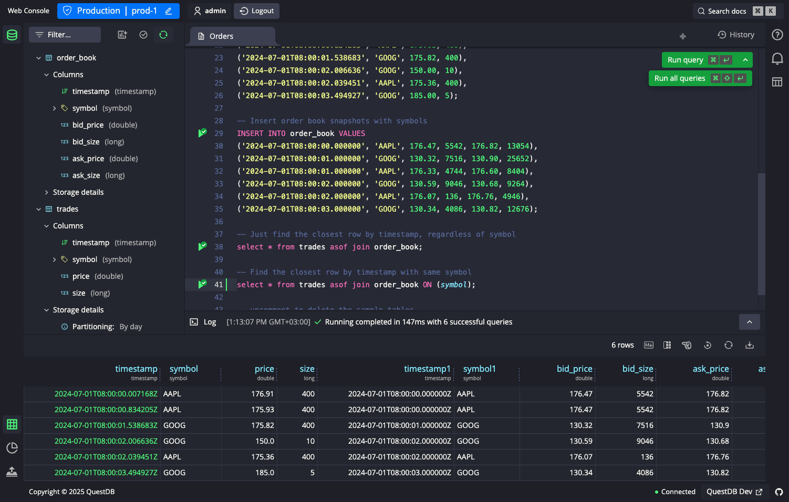

<div align="center">
  
</div>
<p>&nbsp;</p>

<p align="center">
  <a href="https://slack.questdb.io">
    
  </a>
  <a href="https://github.com/questdb/questdb/blob/master/LICENSE.txt">
    
  </a>
  <a href="#contribute">
    
  </a>
  <a href="https://dev.azure.com/questdb/questdb">
    
  </a>
  <a href="https://search.maven.org/search?q=g:org.questdb">
    
  </a>
</p>

简体中文 | [English](./README.md)

# QuestDB

QuestDB 是一个高性能、开源的 SQL 数据库，适用于金融服务、物联网、机器学习
、DevOps 和可观测性应用。它拥有支持 PostgreSQL 线协议的端点，使用 InfluxDB 线协
议的模式无关的高吞吐数据获取方式，以及用于查询、批量导入和导出的 REST API。
QuestDB 实现了 ANSI SQL 与面向时间的语言功能的本地扩展。这些扩展使得使用关系和时
间序列连接将多个来源的数据关联起来变得简单。QuestDB 通过面向列的存储模型、大规模
并行化矢量执行、SIMD 指令和各种低延迟技术实现了高性能。整个代码库是用 Java 和
C++从头开始构建的，没有任何依赖性，并且 100%没有垃圾回收。

<div align="center">
  <a href="https://demo.questdb.io">
    
  </a>
</div>

## 尝试 QuestDB

我们提供了一个[实时演示](https://demo.questdb.io/)，其中包括最新的 QuestDB 版本
和一个 16 亿行的数据集，其中有 10 年的纽约市出租车行程供查询。为了运行 QuestDB，
可以使用 Docker 来快速启动。

```bash
docker run -p 9000:9000 -p 9009:9009 -p 8812:8812 questdb/questdb
```

macOS 用户可以使用 Homebrew。

```bash
brew install questdb
brew services start questdb
```

[QuestDB 下载页面](https://questdb.io/get-questdb/) 提供二进制文件的直接下载，并
有其他安装和部署方法的详细信息。

### 连接到 QuestDB

你可以使用以下接口与 QuestDB 进行交互。

- [网络控制台](https://questdb.io/docs/reference/web-console/) 在端口 `9000` 上
  监听
- 端口 `9000` 的 [REST API](https://questdb.io/docs/reference/api/rest/)
- [PostgreSQL 的](https://questdb.io/docs/reference/api/postgres/) 线程协议，端
  口为 `8812`
- [InfluxDB](https://questdb.io/docs/reference/api/influxdb/)线路协议，用于
  `9009` 端口的高吞吐量摄取

## QuestDB 与其他开源 TSDB 的对比情况

下面是[时间序列基准套件](https://github.com/timescale/tsbs) `cpu-only` 用例的摄
取结果，在具有 16 个核心的 AWS EC2 `m5.8xlarge` 实例上有多达 14 个 threads。

<div align="center">
  <a href="https://questdb.io/time-series-benchmark-suite/">
    
  </a>
</div>

下表显示了在 `c5.metal` 实例上使用 96 个线程中的 16 个线程运行 10 亿条记录的查询
执行时间。

| 查询                                                      | 运行时间   |
| --------------------------------------------------------- | ---------- |
| `SELECT sum(double) FROM 1bn`                             | 0.061 secs |
| `SELECT tag, sum(double) FROM 1bn`                        | 0.179 secs |
| `SELECT tag, sum(double) FROM 1bn WHERE timestamp='2019'` | 0.05 secs  |

## 文件和资源

- QuestDB [文档](https://questdb.io/docs/introduction/)描述了如何运行和配置
  QuestDB 的技术参考。
- [我们的 Slack 工作区](https://slack.questdb.io)是一个进行技术讨论和认识其他用
  户的好地方。👋
- 由我们的社区成员编写的[教程](https://questdb.io/tutorial/)展示了 QuestDB 的可
  能应用。
- [Stack Overflow 上的 QuestDB](https://stackoverflow.com/questions/tagged/questdb)有
  常见的故障排除方案。
- [GitHub 问题被用来](https://github.com/questdb/questdb/issues)跟踪错误报告和功
  能请求。
- [产品路线图](https://github.com/questdb/questdb/projects/3)列出了我们目前正在
  进行的任务和功能。

## 贡献

我们总是乐于接受对项目的贡献，无论是源代码、文档、错误报告、功能请求还是反馈。要
开始贡献。

- 请看一下 GitHub 上标有
  "[Good first issue](https://github.com/questdb/questdb/issues?q=is%3Aissue+is%3Aopen+label%3A%22Good+first+issue%22)"
  的问题。
- 阅
  读[贡献指南](https://github.com/questdb/questdb/blob/master/CONTRIBUTING.md)。
- 有关构建 QuestDB 的详细信息，请参
  见[构建说明](https://github.com/questdb/questdb/blob/master/core/README.md)。
- [创建](https://docs.github.com/en/github/getting-started-with-github/fork-a-repo)QuestDB
  的一个分叉，并提交一个 pull request，说明你的修改建议。

为了表示感谢，我们将向贡献者发送一些我们的 QuestDB 礼品，如贴纸和 T 恤衫 🌟
