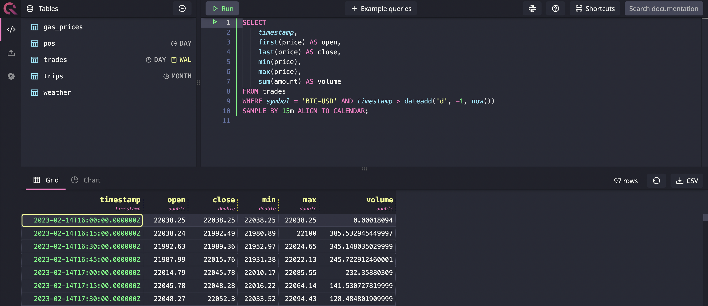

<div align="center">
  
</div>
<p>&nbsp;</p>

<p align="center">
  <a href="https://github.com/questdb/questdb/blob/master/LICENSE.txt">
    
  </a>
  <a href="https://www.codacy.com/app/bluestreak/nfsdb">
    
  </a>
  <a href="https://circleci.com/gh/questdb/questdb">
    
  </a>
  <a href="https://search.maven.org/search?q=g:org.questdb">
    
  </a>
  <a href="https://slack.questdb.io">
    
  </a>
</p>

<div align="center">

<!-- ALL-CONTRIBUTORS-BADGE:START - Do not remove or modify this section -->
[](#contributors)
<!-- ALL-CONTRIBUTORS-BADGE:END -->
</div>

## What is QuestDB

QuestDB is an open source database designed to make time series lightning fast
and easy.

It uses a column-oriented approach, vectorized execution, SIMD instructions, and
a whole array of low-latency techniques. The whole code base is built from
scratch and without dependencies, in the name of performance. We are 100% free
from garbage collection.

QuestDB implements SQL, and augments it for time-series. It exposes a Postgres
wire protocol, a high-performance REST API, and even supports ingestion with
InfluxDB line protocol. It supports both relational and time-series joins, which
makes it easy to correlate data over time. Writes are durably committed to disk,
meaning that the data is safe - yet instantly accessible.

## Live demo

Query [our demo](http://try.questdb.io:9000) dataset with 1.6 billion rows in
milliseconds.

## Web Console

The interactive console to import data (drag and drop) and start querying right
away. Check our Web Console guide to get started:

<div align="center">
  <a href="https://questdb.io/docs/reference/client/web-console/">
    
  </a>
</div>
<div align="center">
  <a href="https://questdb.io/docs/docs/reference/client/web-console/">
    Web Console guide
  </a>
</div>

## Performance figures

### Raw figures

Number operations per second **per thread**. Writes are durable and written to
disk.

| Operation | 64-bit double  | 32-bit int     |
| --------- | -------------- | -------------- |
| Read      | 120 Million /s | 240 Million /s |
| Write     | 240 Million /s | 480 Million /s |

On a CPU with 6 memory channels, QuestDB can scan through **117GB of data per
second**.

### Queries

Execution time on a c5.metal instance using 16 of the 96 threads available.

| Query                                                     | Runtime    |
| --------------------------------------------------------- | ---------- |
| `SELECT sum(double) FROM 1bn`                             | 0.061 secs |
| `SELECT tag, sum(double) FROM 1bn`                        | 0.179 secs |
| `SELECT tag, sum(double) FROM 1bn WHERE timestamp='2019'` | 0.05 secs  |

## Getting Started

The easiest way to get started is with Docker:

```script
docker run -p 9000:9000 -p 8812:8812 questdb/questdb
```

You can more information about Docker usage on the
[dedicated page](https://questdb.io/docs/get-started/docker/).

#### Alternative methods

- [Start with Homebrew](https://questdb.io/docs/get-started/homebrew/)
- [Start with the binaries](https://questdb.io/docs/get-started/binaries/)

### Connecting to QuestDB

You can interact with QuestDB using:

- [Web Console](https://questdb.io/docs/reference/client/web-console/) listening
  on port `9000`: [localhost:9000](http://localhost:9000)
- [Postgres](https://questdb.io/docs/reference/api/postgres/) on port `8812`
- [REST API](https://questdb.io/docs/reference/api/rest/) on port `9000`

Both the HTTP and PostgreSQL servers reference the database in
`<root_directory>/db`.

You can connect to the Postgres server as follows. The default password is
`quest`:

```script
psql -h localhost -p 8812 -U admin -W -d qdb
```

## Building from source

#### (a) Prerequisites

- Java 11 64-bit
- Maven 3
- Node.js 12 / NPM 6

```script
java --version
mvn --version
node --version
```

#### (b) Clone the Repository

```script
git clone git@github.com:questdb/questdb.git
```

#### (c) Build the Code

Commands below will create JAR without assembling executable binaries nor
building web console.

```script
cd questdb
mvn clean package -DskipTests
```

To package web console with the jar use the following command:

```script
mvn clean package -DskipTests -P build-web-console
```

To build executable binaries use the following command:

```script
mvn clean package -DskipTests -P build-web-console,build-binaries
```

To run tests it is not required to have binaries built nor web console. There
are over 4000 tests that should complete without 2-6 minutes depending on the
system.

```script
mvn clean test
```

#### (d) Run QuestDB

```script
# Create a database root directory and run QuestDB
mkdir <root_directory>
java -p core/target/questdb-5.0.4-SNAPSHOT.jar -m io.questdb/io.questdb.ServerMain -d <root_directory>
```

## Resources

Complete references are available in the
[Documentation](https://questdb.io/docs/introduction/).

Get started:

- [Docker](https://questdb.io/docs/get-started/docker/)
- [Binaries](https://questdb.io/docs/get-started/binaries/)
- [Homebrew](https://questdb.io/docs/get-started/homebrew/)

Develop:

- [Connect](https://questdb.io/docs/develop/connect/)
- [Insert data](https://questdb.io/docs/develop/insert-data/)
- [Query data](https://questdb.io/docs/develop/query-data/)
- [Authenticate](https://questdb.io/docs/develop/authenticate/)

Concepts:

- [SQL extensions](https://questdb.io/docs/concept/sql-extensions/)
- [Storage model](https://questdb.io/docs/concept/storage-model/)
- [Partitions](https://questdb.io/docs/concept/partitions/)
- [Designated timestamp](https://questdb.io/docs/concept/designated-timestamp/)

## Support / Contact

[Slack Channel](https://slack.questdb.io)

## Roadmap

[Our roadmap is here](https://github.com/questdb/questdb/projects/3)

## Contribution

Feel free to contribute to the project by forking the repository and submitting
pull requests. Please make sure you have read our
[contributing guide](https://github.com/questdb/questdb/blob/master/CONTRIBUTING.md).

## Contributors ✨

Thanks to these wonderful people
([emoji key](https://allcontributors.org/docs/en/emoji-key)):

<!-- ALL-CONTRIBUTORS-LIST:START - Do not remove or modify this section -->
<!-- prettier-ignore-start -->
<!-- markdownlint-disable -->
<table>
  <tr>
    <td align="center"><a href="https://github.com/clickingbuttons"><br /><sub><b>clickingbuttons</b></sub></a><br /><a href="https://github.com/questdb/questdb/commits?author=clickingbuttons" title="Code">💻</a> <a href="#ideas-clickingbuttons" title="Ideas, Planning, & Feedback">🤔</a> <a href="#userTesting-clickingbuttons" title="User Testing">📓</a></td>
    <td align="center"><a href="https://github.com/ideoma"><br /><sub><b>ideoma</b></sub></a><br /><a href="https://github.com/questdb/questdb/commits?author=ideoma" title="Code">💻</a> <a href="#userTesting-ideoma" title="User Testing">📓</a> <a href="https://github.com/questdb/questdb/commits?author=ideoma" title="Tests">⚠️</a></td>
    <td align="center"><a href="https://github.com/tonytamwk"><br /><sub><b>tonytamwk</b></sub></a><br /><a href="https://github.com/questdb/questdb/commits?author=tonytamwk" title="Code">💻</a> <a href="#userTesting-tonytamwk" title="User Testing">📓</a></td>
    <td align="center"><a href="http://sirinath.com/"><br /><sub><b>sirinath</b></sub></a><br /><a href="#ideas-sirinath" title="Ideas, Planning, & Feedback">🤔</a></td>
    <td align="center"><a href="https://www.linkedin.com/in/suhorukov"><br /><sub><b>igor-suhorukov</b></sub></a><br /><a href="https://github.com/questdb/questdb/commits?author=igor-suhorukov" title="Code">💻</a> <a href="#ideas-igor-suhorukov" title="Ideas, Planning, & Feedback">🤔</a></td>
    <td align="center"><a href="https://github.com/mick2004"><br /><sub><b>mick2004</b></sub></a><br /><a href="https://github.com/questdb/questdb/commits?author=mick2004" title="Code">💻</a> <a href="#platform-mick2004" title="Packaging/porting to new platform">📦</a></td>
    <td align="center"><a href="https://rawkode.com"><br /><sub><b>rawkode</b></sub></a><br /><a href="https://github.com/questdb/questdb/commits?author=rawkode" title="Code">💻</a> <a href="#infra-rawkode" title="Infrastructure (Hosting, Build-Tools, etc)">🚇</a></td>
  </tr>
  <tr>
    <td align="center"><a href="https://solidnerd.dev"><br /><sub><b>solidnerd</b></sub></a><br /><a href="https://github.com/questdb/questdb/commits?author=solidnerd" title="Code">💻</a> <a href="#infra-solidnerd" title="Infrastructure (Hosting, Build-Tools, etc)">🚇</a></td>
    <td align="center"><a href="http://solanav.github.io"><br /><sub><b>solanav</b></sub></a><br /><a href="https://github.com/questdb/questdb/commits?author=solanav" title="Code">💻</a> <a href="https://github.com/questdb/questdb/commits?author=solanav" title="Documentation">📖</a></td>
    <td align="center"><a href="https://shantanoo-desai.github.io"><br /><sub><b>shantanoo-desai</b></sub></a><br /><a href="#blog-shantanoo-desai" title="Blogposts">📝</a> <a href="#example-shantanoo-desai" title="Examples">💡</a></td>
    <td align="center"><a href="http://alexprut.com"><br /><sub><b>alexprut</b></sub></a><br /><a href="https://github.com/questdb/questdb/commits?author=alexprut" title="Code">💻</a> <a href="#maintenance-alexprut" title="Maintenance">🚧</a></td>
    <td align="center"><a href="https://github.com/lbowman"><br /><sub><b>lbowman</b></sub></a><br /><a href="https://github.com/questdb/questdb/commits?author=lbowman" title="Code">💻</a> <a href="https://github.com/questdb/questdb/commits?author=lbowman" title="Tests">⚠️</a></td>
    <td align="center"><a href="https://tutswiki.com/"><br /><sub><b>chankeypathak</b></sub></a><br /><a href="#blog-chankeypathak" title="Blogposts">📝</a></td>
    <td align="center"><a href="https://github.com/upsidedownsmile"><br /><sub><b>upsidedownsmile</b></sub></a><br /><a href="https://github.com/questdb/questdb/commits?author=upsidedownsmile" title="Code">💻</a></td>
  </tr>
</table>

<!-- markdownlint-enable -->
<!-- prettier-ignore-end -->
<!-- ALL-CONTRIBUTORS-LIST:END -->

This project follows the
[all-contributors](https://github.com/all-contributors/all-contributors)
specification. Contributions of any kind welcome!
