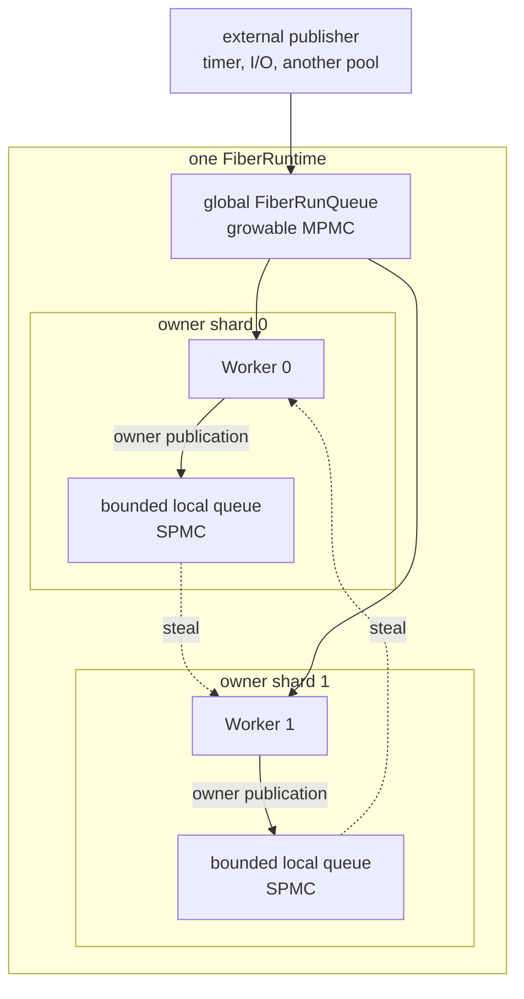
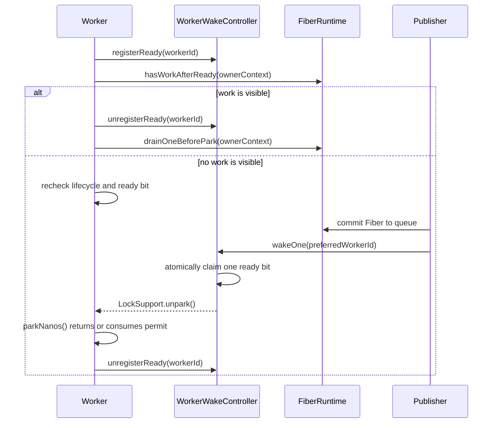
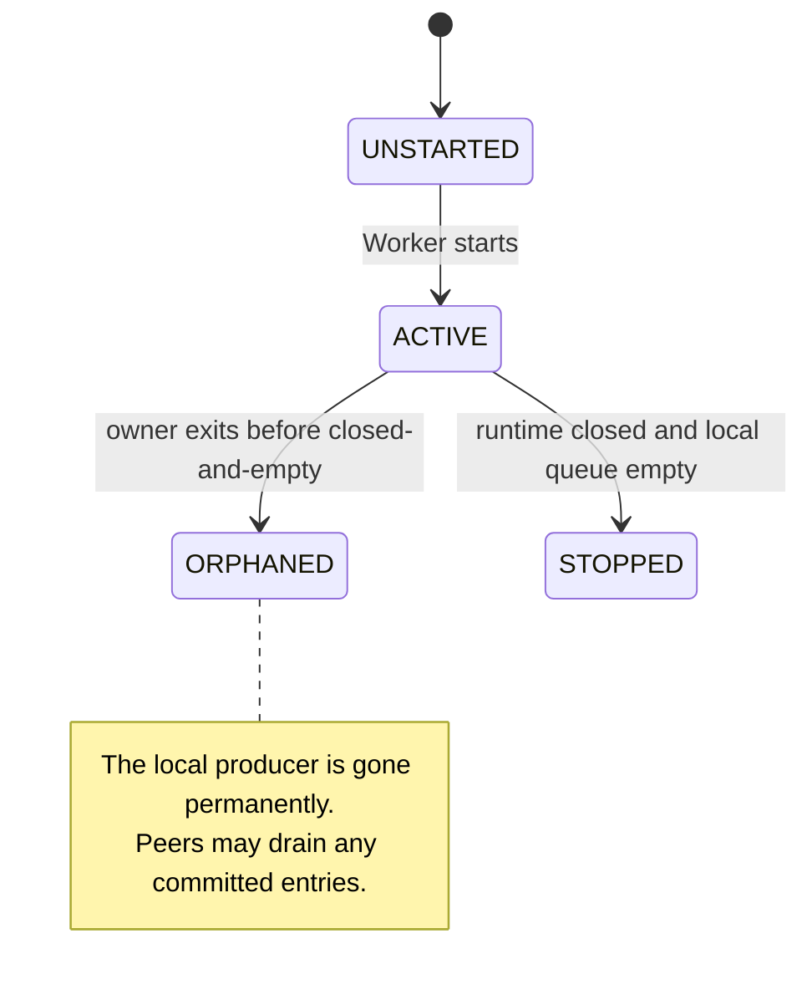

# Fiber scheduling and Worker wake-up

This note records the queueing, affinity, wake-up, and owner-exit protocols
used by a pool-bound `FiberRuntime`.

## Scheduling model

A Fiber-host pool has one runtime, one fixed owner shard per Worker, and one
global injection queue:

The queues do not bind a Fiber permanently to a Worker. A local queue records
where work was published; any Worker may claim its head. The global queue is
the common rendezvous point for publishers that cannot service this runtime.

Each local queue has one producer: its active owner. The owner and all peers
are consumers, so `FiberLocalRunQueue` is a bounded SPMC sequence-slot queue.
Its capacity is fixed when the runtime is constructed. The target is twice
the initial per-Worker fair share of the live-Fiber limit, bounded to 2 through
256 slots and rounded to a power of two. A failed local offer does not block or
resize the queue; the publisher falls back to the global queue.

The global `FiberRunQueue` is growable and MPMC. Standalone runtimes, which
have no owner shards, use only this queue.

## Publication routing

`FiberRuntime.publish()` chooses a route from the publisher's relationship to
the runtime and from the kind of publication:

| Publication | Queue | Wake policy |
| --- | --- | --- |
| Active owner requests or reschedules work | its local queue | no wake |
| Owner-local offer is unavailable | global queue | wake one ready peer |
| External or cross-runtime request | global queue | prefer the last mounter, then any ready Worker |
| Detached post-processing resignal | global queue | wake any ready Worker |
| Owner-generated shutdown cleanup | global queue | no wake |

Shutdown cleanup is forced global so it remains behind older injected work
instead of receiving owner-local priority. If cleanup is published without an
active owner, it receives a generic wake like any other external publication.

Every waking route follows one ordering rule:

> Commit the Fiber to a queue before attempting to wake a Worker.

The wake is a progress notification, not part of queue ownership. If wake-up
or its metrics fail, the committed Fiber remains available for a later drain.

A successful local publication deliberately does not wake a parked peer. Its
publisher is already an active Worker and will return to `drainOwned()`. Local
overflow is different: the bounded locality window is unavailable, so the
global commit also wakes one peer to expose parallelism.

## Selection and fairness

The normal owner selection order is:

1. probe the global queue when the shard's global countdown is due;
2. recover work from an advertised orphan shard;
3. consume the owner's local queue;
4. recheck the global queue after local and orphan checks found nothing;
5. try one peer local queue, advancing a round-robin steal cursor.

The periodic global probe prevents continuous owner-local traffic from
starving external injection. `GLOBAL_PROBE_INTERVAL` is 61 successful
selections, and initial countdowns are staggered across Workers so they do not
all probe at once. This is bounded fairness, not strict FIFO ordering across
the global and local queues.

The unconditional global check after an empty local queue is a liveness
requirement, not a latency refinement. The probe countdown advances only on
successful selections and the pre-park scan runs only when a Worker idles, so
a Worker whose Jobs stay busy and whose local queue is empty would otherwise
never select injected work. Stealing only one rotating victim on the normal
path bounds the cost of an unsuccessful selection.

The final pre-park search is intentionally stronger. It checks the global
queue, the owner's local queue, and every peer local queue. A detached drain,
used during terminal cleanup, also checks the global queue and every local
queue, starting from a rotating shard.

## Resume affinity

Before mounting a Fiber, the runtime records the mounting Worker's id in
`Fiber.lastMountWorkerId`. A new Fiber reservation resets the field so a
reused Fiber cannot inherit an unrelated task's history.

An external normal publication passes this id to the wake controller. If that
Worker is currently a ready wake target, it is claimed first; otherwise the
controller chooses another ready Worker using its rotating cursor.

The hint affects only which parked Worker is made runnable. The Fiber is still
published globally, any active Worker may dequeue it, and a successful steal
updates the hint at the next mount. Resume affinity is therefore best effort,
not pinning or exclusive ownership.

Owner-local placement and last-mounter preference are separate mechanisms:

- local placement preserves locality for work produced by the current owner;
- last-mounter preference guides an external wake when no owner can execute
  the work directly.

## Ready-Worker protocol

`WorkerWakeController` maintains a ready bitmap and a summary count for the
fixed Workers in one Fiber-host pool. A ready bit means that a Worker has
entered the idle protocol and may be selected for one wake; it does not imply
that the thread has already blocked.

A ready bit can satisfy at most one wake claim. `wakeOne()` atomically clears
either the preferred bit or one selected from the rotating cursor. The wake
path that claims the bit owns the corresponding `LockSupport.unpark()`. A
Worker may instead clear its own bit to withdraw readiness. Concurrent
publishers therefore do not repeatedly select the same ready Worker. The count
avoids a bitmap scan when no Worker is ready; the bitmap remains the authority
for an individual claim.

A Worker parks through this handshake:

This ordering closes the lost-wake race:

- a publication committed before ready registration is found by the Worker's
  post-registration search;
- a waking publication committed after registration either claims the ready
  bit and unparks the Worker or finds that another wake already claimed it;
- an unpark immediately before `parkNanos()` leaves a permit, so the park
  returns without waiting for its timeout.

Before mounting work found during the post-registration search, the Worker
removes its ready bit. A long-running continuation must not leave its carrier
advertised as idle while publishers could wake a genuinely parked sibling.

Interrupt handling preserves a newly arrived interrupt for one complete
Worker iteration. If user work does not consume it, the idle path clears the
status and consumes the associated park permit before registering a fresh
ready bit; an ignored interrupt therefore cannot turn idle parking into a
permanent busy loop.

## Orphan-shard recovery

An orphan is an owner shard whose Worker has exited. It is not a failed or
discarded Fiber. Any committed Fibers left in that shard's local queue remain
runnable and must be recovered by other carriers.

The owner state transition is:

`onOwnerExit()` changes `ACTIVE` to `ORPHANED` before advertising local work.
This revokes the queue's only producer, so an empty observation during recovery
cannot race with a later local offer.

If the local queue is non-empty, the runtime sets the shard's bit in
`orphanedWords`, increments `orphanedCount`, rechecks the queue, and wakes one
ready Worker. The summary count skips bitmap scans when no orphan work is
advertised. A peer uses its rotating cursor to find a set bit, claims the
queue head through the normal SPMC consumer path, and clears the bit after the
queue becomes empty. Ordinary stealing and detached draining perform the same
empty-bit cleanup.

The bitmap is a discovery index, not the ownership mechanism and not a Fiber
count. The local queue's head claim determines exactly which consumer receives
an entry. If a peer drains the last entry while advertisement is being
completed, the publisher's post-advertisement recheck clears the now-stale bit.

An exiting owner with an empty local queue may still have consumed the wake
responsibility for visible global work. In that case `onOwnerExit()` sends a
generic wake so another ready Worker takes over progress.

## Quiesce and shutdown

`beginQuiesce()` wakes all registered ready Workers. Active owners continue
draining until the runtime satisfies its close conditions. If a Worker exits
unexpectedly or during shutdown with local work, orphan advertisement makes
that work discoverable by its peers or by a later detached drain.

Runtime closure checks both the global queue and every local queue. A queue
entry cannot be ignored merely because its owner is no longer active.

## Required invariants

- Only an `ACTIVE` shard owner may publish to its local queue.
- The local queue has exactly one producer and any number of consumers.
- Queue commit precedes every wake attempt.
- A Worker publishes its ready bit before its final work search.
- A Worker clears its ready bit before mounting a Fiber.
- A wake path that claims a ready bit owns exactly one unpark operation.
- Owner exit revokes local production before orphan work is advertised.
- Orphan bits are cleared only after the corresponding local queue is
  observed empty.
- Global injection is probed periodically during continuous local traffic.
- A Worker whose local queue is empty checks the global queue on every
  selection.
- Shutdown and detached drains account for every global and local queue.

Queue availability, depth, ready count, and orphan count are discovery or
diagnostic summaries. Atomic queue and bitmap claims decide ownership; code
must not use an approximate observation as proof that work was consumed.

## Observability and validation

`FiberMetrics` exposes scheduler publications by `owner_local`, `global`, and
`local_fallback`; selections by `owner_local`, `global`, and `stolen_local`;
successful wake claims; orphan-shard transitions; and recovered orphan
entries. These counters diagnose routing and recovery without introducing
per-Worker metric labels.

Focused tests are split by protocol:

- `FiberLocalRunQueueTest` covers capacity, wrap-around, stalled consumers,
  reuse, and concurrent exactly-once consumption;
- `WorkerWakeControllerTest` covers ready registration, unique wake claims,
  preferred selection, cursor wrap-around, and wake-all reconciliation;
- `FiberAffinitySchedulingTest` covers publication routing, lost-wake races,
  last-mounter preference, global fairness, overflow wake-up, owner exit,
  orphan recovery, interrupts, and shutdown.

## Files

- `core/src/main/java/io/questdb/mp/continuation/FiberRuntime.java`
- `core/src/main/java/io/questdb/mp/continuation/FiberLocalRunQueue.java`
- `core/src/main/java/io/questdb/mp/continuation/FiberWakeSink.java`
- `core/src/main/java/io/questdb/mp/continuation/Fiber.java`
- `core/src/main/java/io/questdb/mp/WorkerWakeController.java`
- `core/src/main/java/io/questdb/mp/Worker.java`
- `core/src/main/java/io/questdb/mp/WorkerPool.java`
- `core/src/main/java/io/questdb/metrics/FiberMetrics.java`
