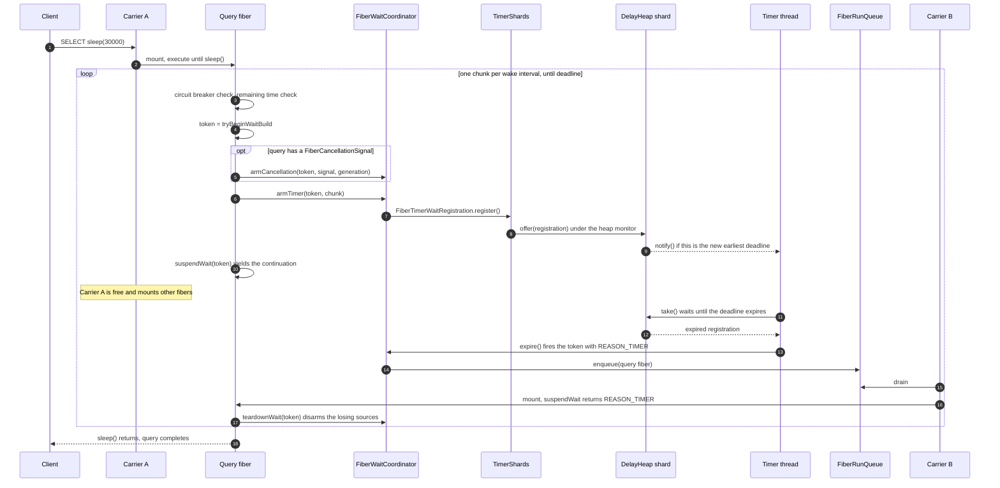
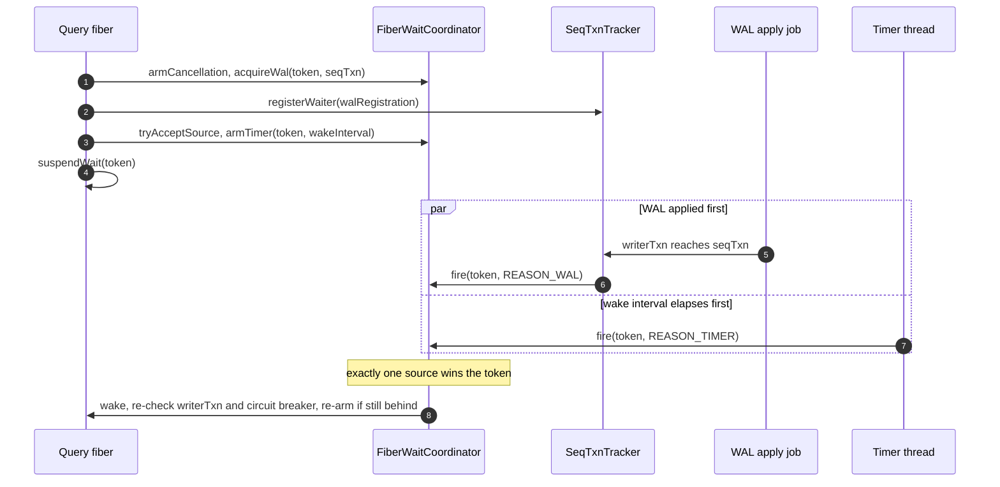
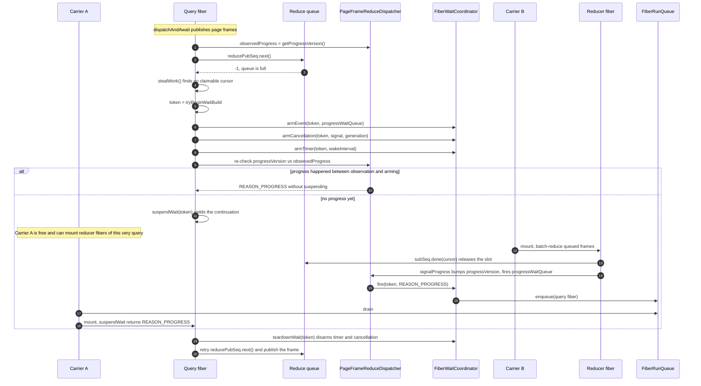

# DelayHeap

`TimerShards` uses `DelayHeap` instead of
`java.util.concurrent.DelayQueue`.

## Continuation-safety requirement

A timer registration can call
`FiberTimerWaitRegistration.register()` -> `TimerShards.register()` ->
`DelayHeap.offer()` from inside a mounted raw continuation.

JDK `DelayQueue` uses `ReentrantLock` and `Condition`. Their ownership is
expressed through Java `Thread` state. C2 can retain a stale
`Thread.currentThread()` value across raw continuation migration, which has
caused `IllegalMonitorStateException` in `DelayQueue.offer()` and left its
lock permanently held.

`DelayHeap` uses JVM monitors instead:

- each public heap operation is `synchronized`;
- the single consumer waits with `Object.wait()`;
- a producer wakes it with `Object.notify()`.

Monitor ownership uses the VM's executing `JavaThread`, not a Java
`Thread.currentThread()` value cached in a continuation frame.

No method may yield a continuation while holding the heap monitor. Heap
methods may perform only private priority-queue operations, time checks, and
monitor wait/notify.

## TimerShards lifecycle

Each shard has one `DelayHeap` and one daemon consumer:

1. `start()` publishes all timer threads.
2. `register()` selects a shard by registration identity and offers the entry.
3. The consumer takes the next expired entry and calls `expire()`.
4. `unregister()` removes a losing timer registration.
5. `shutdown()` closes registration, wakes and joins consumers, drains every
   unexpired entry, and calls `shutdown()` exactly once for each retained
   entry.

A late registration returns `NOT_ACCEPTED`. If heap insertion throws before
retaining the registration, the registration must roll its state back and
release its in-flight accounting before propagating the error.

The poison sentinel wakes a consumer blocked on an empty or future-only heap.
If shutdown races after `take()` has removed a real entry, that consumer owns
the entry and calls its shutdown hook rather than dropping it.

## Sequence: a query calling sleep() on a fiber

`SleepFunctionFactory` never sleeps the carrier thread. It waits in chunks of
`cairo.query.continuation.wake.interval.millis` so a cancelled or disconnected
query is detected within one interval even though the timer is the only wake
source. Each chunk arms a fresh timer registration, suspends the fiber, and
frees the carrier for other work.

The wait token multiplexes every armed source into a single park: the first
source to fire wins the token and wakes the fiber; `teardownWait()` cancels
the losers (here the cancellation registration, or the timer when the
cancellation fires first). The resumed fiber may run on any carrier, not
necessarily the one it suspended on.

### wait_wal_table() differences

`WaitWalFunction.waitInFiber()` arms one more source before the timer: a
`FiberWalWaitRegistration` registered with the table's `SeqTxnTracker`. The
timer is a fallback that bounds how long a cancellation or disconnect can go
unnoticed; the expected wake is the WAL apply job reaching the requested
`seqTxn`. The wake loop re-checks `writerTxn` and re-arms until the
transaction is visible.

## Sequence: parallel GROUP BY parked on a full reduce queue

A parallel GROUP BY (`UnorderedPageFrameSequence.dispatchAndAwait()`) can
suspend mid-query when the reduce queue is full and work-stealing finds no
claimable cursor. The fiber parks on the dispatcher's progress wait queue;
any reducer completing any frame signals progress. A timer registration is
armed alongside as the cancellation-check fallback, which is what ties this
path to `DelayHeap`.

Reading `observedProgress` before observing the full queue is the lost-wakeup
guard: if a reducer completes and bumps the version after the queue-full
observation but before `suspendWait()`, the armed-state re-check returns
`REASON_PROGRESS` immediately instead of parking against a signal that
already fired. The same choreography parks the collect phase (`await()`)
until the done latch reaches the queued-frame count, and a `REASON_TIMER`
wake re-checks the circuit breaker so a parked query stays cancellable.

## Complexity

Insert and expiry are `O(log n)`. `PriorityQueue.remove(Object)` is `O(n)`, so
cancelling many losing timers on one shard can become expensive. An indexed
intrusive heap would be the next step if cancellation profiles make this
cost material; it must preserve the no-yield monitor rule and zero-allocation
steady state.

## Tests

`DelayHeapTest` covers ordering, concurrent producers, single-consumer
delivery, removal, draining, and waking a consumer when an earlier deadline
arrives.

`FiberWaitRegistrationTest` covers timer cancellation, shutdown, holder reuse,
and registration-failure rollback. Server-level sleep and
`wait_wal_table()` tests cover the complete timer-to-fiber wake path.

## Files

- `core/src/main/java/io/questdb/mp/continuation/DelayHeap.java`
- `core/src/main/java/io/questdb/mp/continuation/TimerShards.java`
- `core/src/main/java/io/questdb/mp/continuation/FiberTimerWaitRegistration.java`
- `core/src/test/java/io/questdb/test/mp/DelayHeapTest.java`
- `core/src/test/java/io/questdb/test/mp/FiberWaitRegistrationTest.java`
