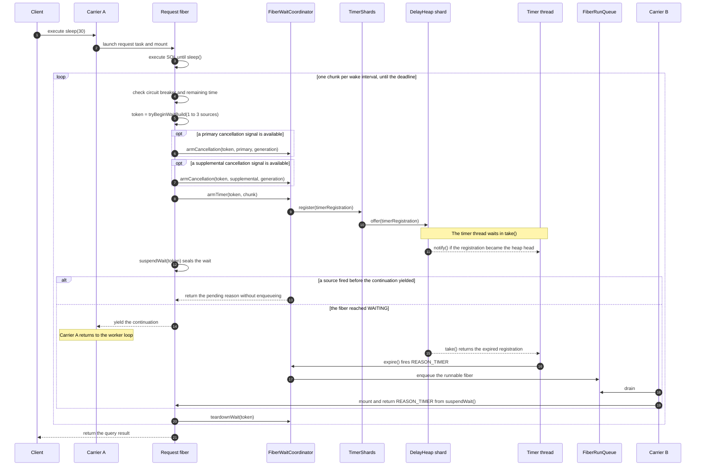
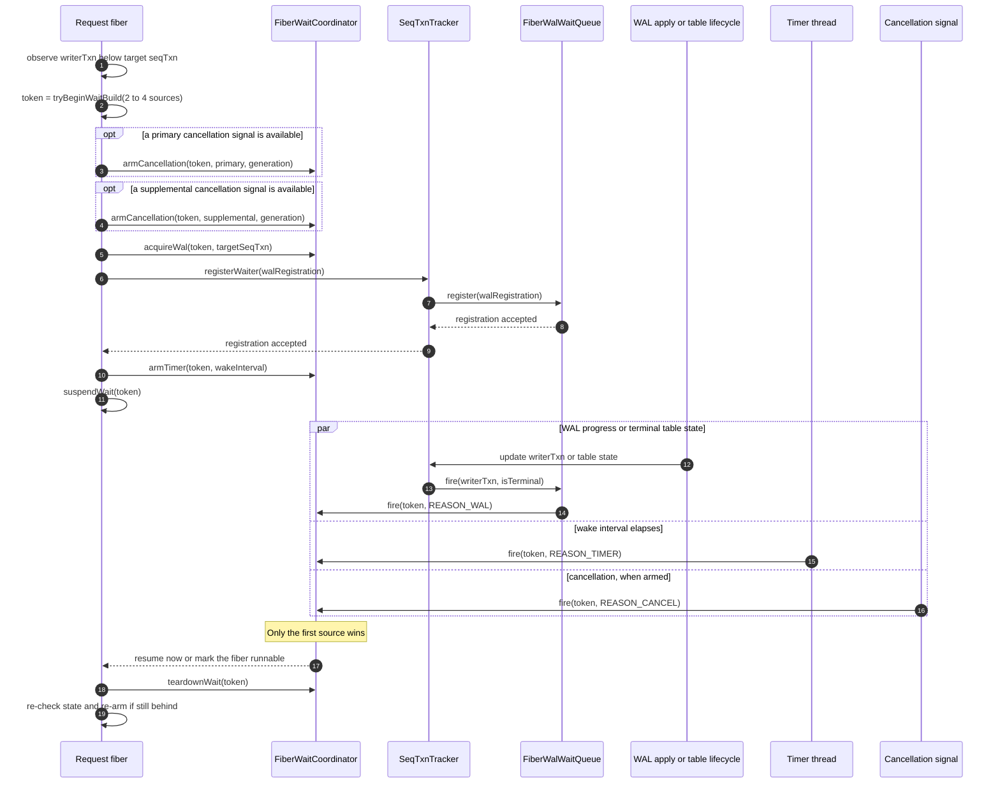
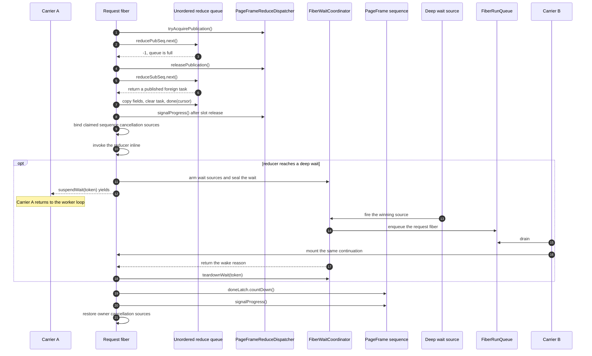
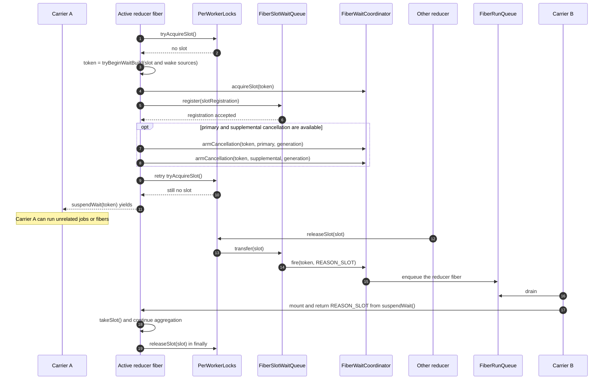

# DelayHeap

`TimerShards` uses `DelayHeap` instead of
`java.util.concurrent.DelayQueue`.

## Continuation-safety requirement

A timer registration can call
`FiberTimerWaitRegistration.register()` -> `TimerShards.register()` ->
`DelayHeap.offer()` from inside a mounted raw continuation.

JDK `DelayQueue` uses `ReentrantLock` and `Condition`. Their ownership is
expressed through Java `Thread` state. C2 can retain a stale
`Thread.currentThread()` value across raw continuation migration, which has
caused `IllegalMonitorStateException` in `DelayQueue.offer()` and left its
lock permanently held.

`DelayHeap` uses JVM monitors instead:

- each public heap operation is `synchronized`;
- the single consumer waits with `Object.wait()`;
- a producer wakes it with `Object.notify()`.

Monitor ownership uses the VM's executing `JavaThread`, not a Java
`Thread.currentThread()` value cached in a continuation frame.

No method may yield a continuation while holding the heap monitor. Heap
methods may perform only private priority-queue operations, time checks, and
monitor wait/notify.

## TimerShards lifecycle

Each shard has one `DelayHeap` and one daemon consumer:

1. `start()` publishes all timer threads.
2. `register()` selects a shard by registration identity and offers the entry.
3. The consumer takes the next expired entry and calls `expire()`.
4. `unregister()` removes a losing timer registration.
5. `shutdown()` closes registration, wakes and joins consumers, drains every
   unexpired entry, and calls `shutdown()` exactly once for each retained
   entry.

A late registration returns `NOT_ACCEPTED`. If heap insertion throws before
retaining the registration, the registration must roll its state back and
release its in-flight accounting before propagating the error.

The poison sentinel wakes a consumer blocked on an empty or future-only heap.
If shutdown races after `take()` has removed a real entry, that consumer owns
the entry and calls its shutdown hook rather than dropping it.

## Sequence: a request calling sleep() on a fiber

The argument to `sleep()` is seconds. `SleepFunctionFactory` never blocks the
carrier thread. It divides the requested duration into chunks no longer than
`griffin.query.continuation.wake.interval`. Each chunk arms a timer and, when
the circuit breaker exposes one, a cancellation signal. The timer drives the
normal sleep deadline; the chunks also bound how long a cancellation or
disconnect without a signal can go unchecked.

The wait token multiplexes every accepted source into one logical park. The
first source wins. A source that fires while the wait is still building or
parking records a pending resume, so `suspendWait()` returns without yielding
or touching the run queue. A source that fires after the fiber reaches
`WAITING` moves it to `RUNNABLE` and enqueues it. `teardownWait()` cancels the
losing registrations. Any carrier may resume the fiber.

### wait_wal_table() differences

`WaitWalFunction.waitInFiber()` adds a `FiberWalWaitRegistration` to the
sources used above. The table's `SeqTxnTracker` fires it when `writerTxn`
reaches the requested `seqTxn`, or when the table becomes terminal. The timer
provides a periodic circuit-breaker fallback. The loop re-checks
`writerTxn`, table state, and the circuit breaker after every wake, then
re-arms if the transaction is still not visible.

## Sequence: parallel GROUP BY owner-inline reduction

A parallel GROUP BY uses `UnorderedPageFrameSequence`. One place its request
fiber can suspend is inside a reducer that it claims while work-stealing. The
owner first releases its publication permit. This keeps quiesce from waiting
on a permit held by a parked fiber and lets other publishers observe the queue
slot as soon as the owner releases it.

The dispatcher's progress event covers more than completed reductions. For
an unordered task, the owner copies the task fields, releases the queue slot,
and signals progress before it invokes the reducer. It runs the reducer on the
already mounted request fiber; it does not launch or mount a nested PageFrame
fiber. A deep wait unmounts that same request fiber. Reduction completion later
counts down the claimed sequence's latch and signals progress again.

If no task is available to steal, the owner uses the dispatcher's progress wait
instead. It reads the progress version before observing the full queue, arms
both the sequence-specific and global progress events, and rechecks both
versions before parking. This closes the lost-wakeup window and lets capacity
released by another query wake the owner. It also arms the primary and
supplemental cancellation signals when present, so sequence failure and target
query cancellation wake the wait directly. The same progress wait supports
the collect phase until the done latch reaches the queued-frame count.

## Sequence: active reducer fiber waiting inside GROUP BY

A reducer may run in a worker-owned `PageFrameFiberTask` or inline on the
request fiber. Either execution context may reach `PerWorkerLocks.acquireSlot()`
deep inside aggregate evaluation. If every per-worker aggregate slot is busy,
the reducer registers a slot waiter, retries acquisition to close the release
race, and then parks. `releaseSlot()` hands the slot directly to one waiter
without making it globally free in between.

If cancellation wins after the queue grants a slot but before the reducer
takes it, registration cleanup returns that granted slot through
`releaseSlot()`. This prevents cancellation from leaking a slot for the
lifetime of the cached GROUP BY atom.

## Complexity

Insert, expiry, and removal are `O(log n)`. Each entry stores its heap index,
so cancelling a losing timer never scans the shard. A shard serializes its
operations on one monitor; `TimerShards` spreads registrations across those
monitors. The backing `ObjList` grows at a new high-water mark and retains
that capacity for later registrations.

## Tests

`DelayHeapTest` covers ordering, concurrent producers, single-consumer
delivery, removal, draining, and waking a consumer when an earlier deadline
arrives.

`FiberWaitRegistrationTest` covers timer cancellation, shutdown, holder reuse,
and registration-failure rollback. Server-level sleep and
`wait_wal_table()` tests cover the complete timer-to-fiber wake path.

## Files

- `core/src/main/java/io/questdb/mp/continuation/DelayHeap.java`
- `core/src/main/java/io/questdb/mp/continuation/TimerShards.java`
- `core/src/main/java/io/questdb/mp/continuation/FiberTimerWaitRegistration.java`
- `core/src/test/java/io/questdb/test/mp/DelayHeapTest.java`
- `core/src/test/java/io/questdb/test/mp/FiberWaitRegistrationTest.java`
