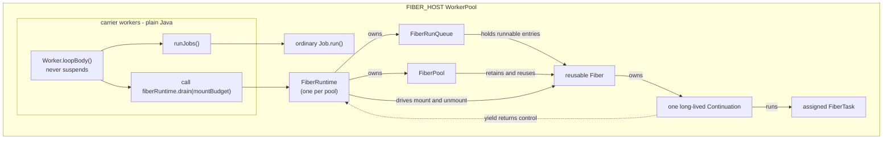
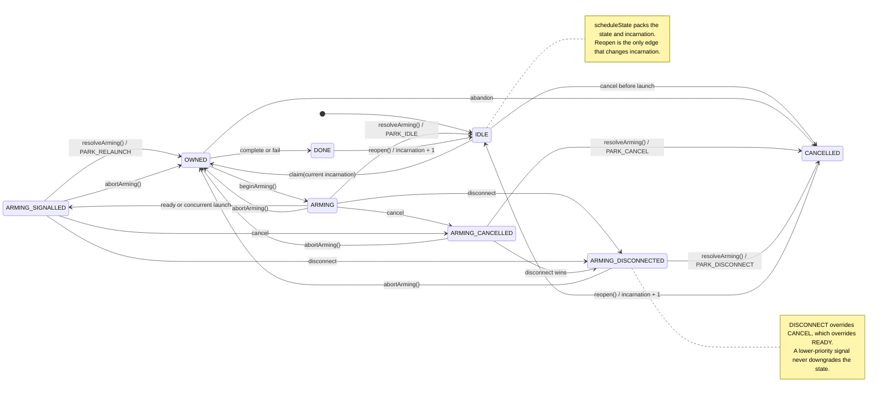
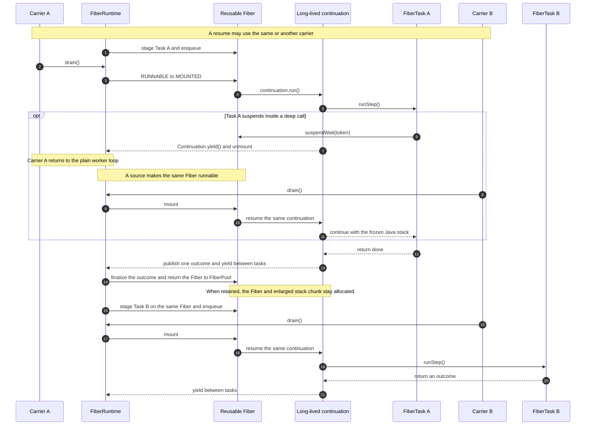
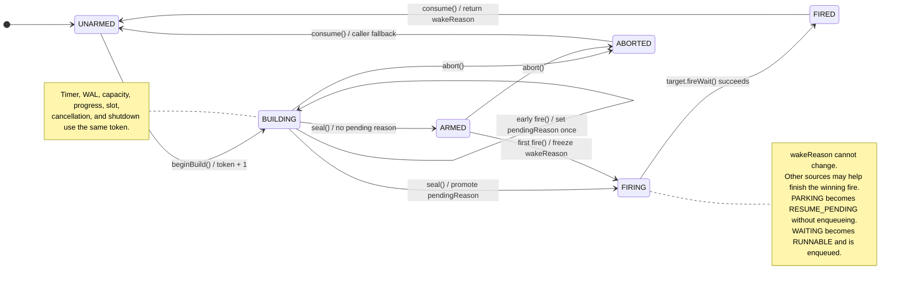

# Fiber runtime notes

This file records implementation invariants for the classes in this
package.

## Scheduler boundary

`Worker.loopBody()` always runs as plain Java. A `FIBER_HOST` pool owns one
`FiberRuntime`; each worker drains that runtime after running its ordinary
jobs. A `LEGACY` pool owns no runtime.

Only `Fiber` mounts a continuation. Production code must not wrap a
`Worker`, `Job`, or page-frame reducer in its own continuation.

`Fiber.current()` identifies the mounted fiber for SQL suspension
gateways. Code outside a mounted fiber receives no implicit suspension
permission.

## Java API migration

Direct Java integrations must rebuild against this scheduler generation.
`WorkerPoolConfiguration.isLegacy()` remains a deprecated read alias, but
custom configurations must override `getWorkerPoolMode()` to select a mode.

The removed `getContinuationSink()`, `ContinuationSink`,
`WorkerContinuation`, `ContinuationQueue`, `TimerCont`, and `TxnWaiter` API
family has no binary-compatible adapter. Replace custom continuation work
with a `FiberTask` launched through `WorkerPool.getFiberRuntime().launch(...)`
on a `FIBER_HOST` pool, or use a `LEGACY` pool for ordinary jobs.

`WorkerPool.halt(long)` remains a deprecated relative-duration bridge to
`haltWithin(long)`. `WorkerPoolManager.halt()` retains its void descriptor;
callers that need the unbounded attempt's completion result use
`haltAndReportCompletion()`. `haltWithin(long)` is the only bounded-shutdown
entry point; it takes a relative nanosecond budget and reports whether the
pool released its object graph, so a caller that times out retries with a
fresh budget.

## Task ownership

`FiberTask.scheduleState` packs an incarnation and state into one CAS word.
The incarnation changes only when a terminal task reopens. Every delayed
notification must carry or validate the incarnation that created it.

The stable states are:

- `IDLE`: launch may claim the task;
- `OWNED`: one fiber owns it;
- `ARMING*`: the runtime publishes a park while ready, cancel, and disconnect
  signals may race;
- `DONE` or `CANCELLED`: callbacks and ownership release have completed.

The diagram shows transitions within one incarnation. A launch, signal, or
cancellation carrying an older incarnation returns stale or false without
changing the recycled task.

The runtime increments `outstandingTaskCount` before publishing an owned task.
Exactly one terminal path decrements it. `onError()` or `onAbandoned()` runs
before `onDone()`.

## Fiber execution

A `Fiber` has two independent state machines.

Execution state tracks free, runnable, mounted, parking, resume-pending,
waiting, and done. Notification state tracks idle, queued, processing, and
resignal. The second machine coalesces repeated wakes without allocating queue
nodes.

An early wake changes `PARKING` to `RESUME_PENDING`. It must not enqueue the
fiber while its carrier still owns the mounted continuation. After physical
unmount, `publishWaiting()` either publishes `WAITING` or converts the pending
wake to `RUNNABLE`.

The continuation body stays alive across task reuse. It yields when idle,
runs the assigned task, publishes one outcome, and yields again. Quiesce marks
the fiber for retirement; the body abandons an assigned task that never began
and then returns.

The mount driver must never leave a failed fiber in `MOUNTED`. If driver code
cannot recover or retry a mount, it must terminally complete the owned task,
retire the fiber, unregister it, and balance all runtime counters.

## Page-frame owner execution

A Fiber-host PageFrame reducer has two valid execution boundaries:

- an ordinary query worker claims the ring task and transfers it to a pooled
  `PageFrameFiberTask`;
- an already mounted query owner claims local or stolen work and runs the
  reducer inline on its current Fiber.

The owner path preserves Legacy work stealing without mounting a nested Fiber.
It runs CPU work directly and unmounts only when reducer code reaches a deep
wait. Before stealing or waiting, the owner releases its publication permit.
An ordered owner keeps the claimed ring cursor on its frozen stack; an
unordered owner releases the ring slot before invoking the reducer.

Foreign work temporarily replaces the owner's cancellation scope with the
claimed frame sequence's cancellation signal plus the claimed query's signal,
when available. The Fiber captures both bindings at unmount and installs them
on any resume carrier. Reducer completion restores the owner's exact signal
and generation. Sequence cancellation wakes deep waits but does not mutate the
shared query circuit breaker.

## Wait publication

`FiberWaitCoordinator` owns one tokenized wait at a time. The protocol is:

1. `beginBuild(sourceCount)`;
2. acquire and initialize each source registration;
3. register it with the source, which also completes coordinator acceptance;
4. `seal(token)`;
5. suspend if no source fired early;
6. cancel losing registrations and `consume(token)`.

A source that fires during build records a pending reason. Sealing promotes
that reason through the same firing path used by a later wake. Timer, WAL,
capacity, progress, slot, shutdown, and cancellation therefore share one
arbitration point.

The diagram covers one token. A stale callback with another token cannot move
the coordinator. `teardownWait()` requests cancellation of every losing
registration before the coordinator returns to `UNARMED`; each registration
detaches and returns to its pool only after its source releases ownership.

Every acquired registration increments both coordinator-local and
runtime-visible in-flight counts. Expiry, cancellation, shutdown, rejected
registration, and registration failure must all release that count exactly
once. A registration may return to its coordinator pool only after the source
can no longer call it.

## Admission and quiesce

Launch and wait arming acquire runtime admission. `beginQuiesce()` closes
admission, waits for existing admission holders to leave, and then retires the
fiber pool. New launches and new wait builds fail after that point.

The runtime becomes `CLOSED` only when:

- no task is outstanding;
- no finalizer is running;
- the run queue is empty;
- every created fiber is retired and unregistered; and
- no wait registration remains in flight.

`WorkerPool.halt()` starts this process while carriers still run. It stops
workers and releases job instances only after the runtime closes. A timeout
retains the live object graph.

## Pooling and allocation

`FiberPool`, `FiberRunQueue`, `FiberRing`, wait registrations,
and carrier-local outcome scratch form the warmed zero-allocation scheduler
path. Capacity growth may allocate before the high-water mark stabilizes.

Objects may return to a pool only after all external callbacks lose ownership.
Clear task, error, execution-context, table, timer, and connection references
before reuse.

## Related notes

- `CARRIER_LOCAL.md` explains carrier-keyed state across fiber migration.
- `DELAY_HEAP.md` explains the timer heap and its continuation-safety rules.
