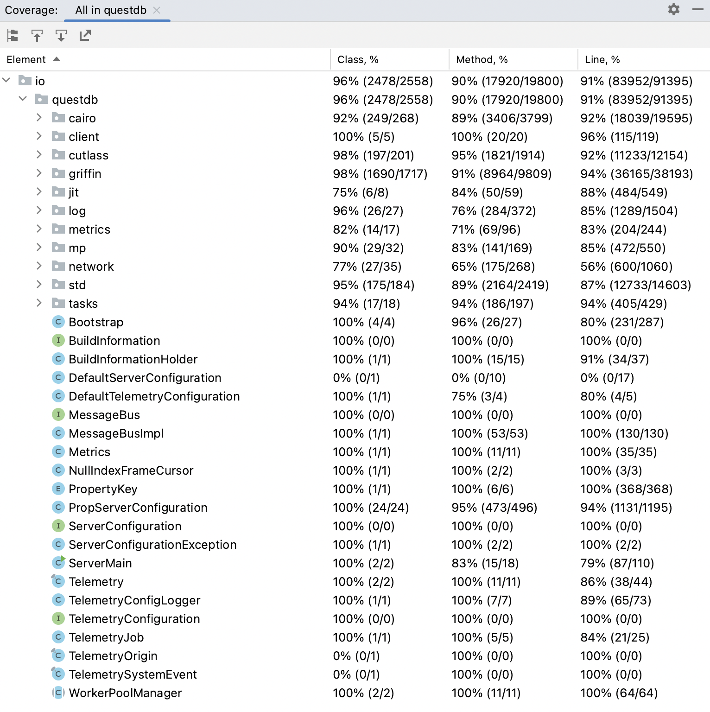
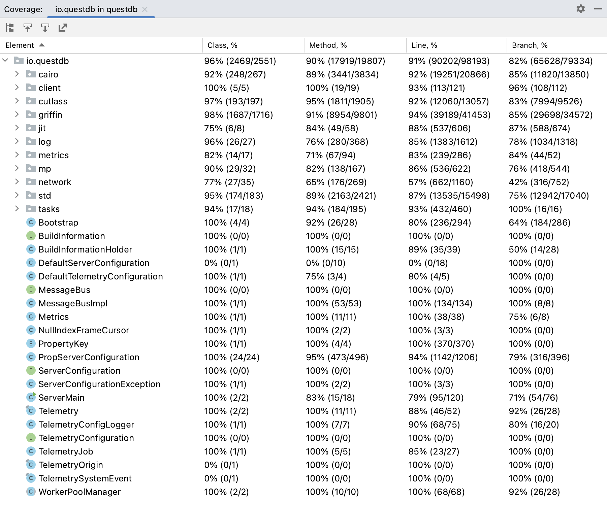
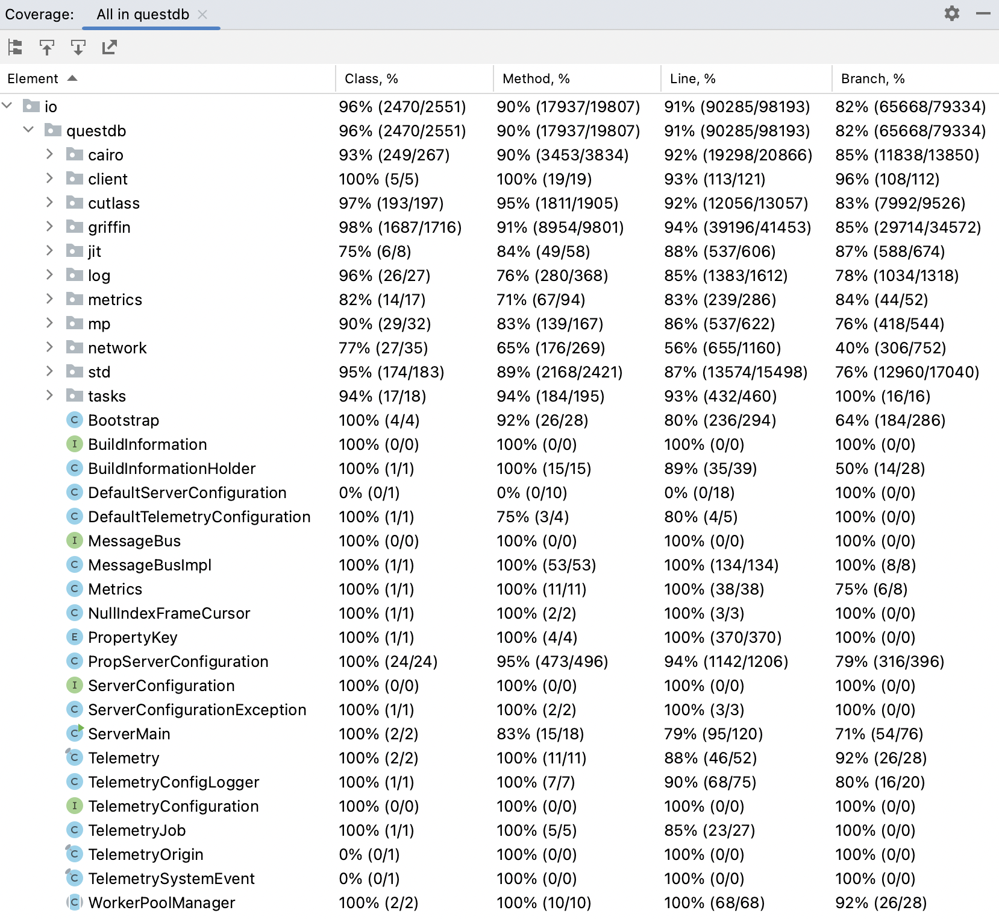

<div align="center">
  <a href="https://questdb.io/" target="blank"></a>
</div>
<p>&nbsp;</p>

# SWE 261P Project Part 3. White Box Testing and Coverage of QuestDB

**Team Member: Jane He, Fengnan Sun, Ming-Hua Tsai**

**GitHub username: [SiyaoIsHiding](https://github.com/SiyaoIsHiding), [SoniaSun810](https://github.com/SoniaSun810), [alimhtsai](https://github.com/alimhtsai)**

**Table of Contents**
1. [Structural Testing](#first)
2. [Coverage of the Existing Test Suite](#second)
3. [New JUnit Test Cases of Structural Testing](#third)
4. [Conclusion](#fourth)

---
<p style="page-break-after:always"></p>

## 1. Structural Testing <a name="first"></a>

[Structural testing, also known as white-box testing](https://en.wikipedia.org/wiki/White-box_testing), is a software testing technique that evaluates the internal structure of the application being tested, rather than just its functionality ([black-box testing](https://en.wikipedia.org/wiki/Black-box_testing)). This involves analyzing individual components, modules, and source code to verify that the application performs as intended and that all code paths are executed correctly.

The main advantages of structural testing are:

1. Early defect detection: Structural testing helps to identify defects and errors in the software development process by scrutinizing the application's internal structure. This enables developers to pinpoint and fix potential problems before releasing the software to users.
2. Improved quality: By concentrating on the internal structure of the application, structural testing can detect performance-critical areas, allowing developers to optimize the code and enhance the system's overall performance. It can also ensure that the codebase adheres to established design and coding standards, resulting in software that is more dependable and maintainable.
3. Improved code coverage: Structural testing provides a comprehensive view of how much of the code has been executed during testing. This enables developers to identify areas of the codebase that have not been thoroughly tested, thereby enhancing test coverage and ensuring that all parts of the software have been thoroughly tested.

However, one primary disadvantage of structural testing is that it may not detect all defects or errors, as some issues may only emerge under specific conditions or in production environments. Therefore, the main objective of structural testing is to increase confidence in the thoroughness of the testing process.

In summary, structural testing is essential for ensuring the quality of the software application. By examining the application's internal structure, structural testing can reveal errors or defects that may not be detected through functional testing. This can help to enhance the overall functionality and reliability of the application, which is critical for ensuring that it meets the needs of its users.

<p style="page-break-after:always"></p>

## 2. Coverage of the Existing Test Suite <a name="second"></a>

### 2.1 Coverage Metrics

We used two coverage tools, Intellij IDEA and [JaCoCo](https://www.jacoco.org/jacoco/trunk/index.html), to measure the extent to which the source code of a program has been tested. There are four types of code coverage metrics:

1. **Line coverage**: This metric measures the percentage of code lines executed during testing. It is the most basic type of code coverage and indicates how many lines of code have been tested in comparison to the total number of lines in the source code.
2. **Branch coverage**: This metric measures the percentage of decision points (branches) that have been executed during testing. It shows how many of the possible paths through the code have been tested.
3. **Method coverage**: This metric measures the percentage of methods that have been executed during testing. It indicates the number of methods that have been executed out of the total number of methods in the code.
4. **Class coverage**: This metric measures the percentage of classes that have been executed during testing. It shows how many of the classes in the code have been tested.

### 2.2 Coverage Results

The results of Coverage Runner JaCoCo and IntelliJ IDEA are as show below. They indicate that the existing test suite has good overall coverage across the four metrics. Class, method, and line coverage are all over 90%, while branch coverage is slightly lower at over 80%. 

|               | Overall Class Coverage | Overall Method Coverage | Overall Line Coverage | Overall Branch Coverage |
|---------------|------------------------|-------------------------|-----------------------|-------------------------|
| Intellij IDEA | 96% (2478/2558)        | 90% (17920/19800)       | 91% (83952/91395)     | -                       |
| JaCoCo        | 96% (2469/2551)        | 90% (17919/19807)       | 91% (90202/98193)     | 82% (65628/79334)       |

<p style="page-break-after:always"></p>

**IntelliJ IDEA Coverage**

<p align="center">
  
</p>

<p style="page-break-after:always"></p>

**JaCoCo Coverage**

<p align="center">
  
</p>

<p style="page-break-after:always"></p>

### 2.3 Uncovered Test Cases

The testing of QuestDB is already quite comprehensive; however, classes and methods in components Jit, Metrics and Network have not been fully tested due to various limitations during testing. Because of these constraints, we did not write more tests for the following three components, but chose to add new test case for class `TableReaderSelectedColumnRecordCursor` in the cairo component, class `SqlKeywords` in the griffin component, and class `ConcurrentHashMap` in the std component. 

- **Jit Component**
    - Current Testing Coverage: 75% (class), 84% (method), 88% (line).
    - Functionality:  JIT stands for "Just-In-Time" compilation, and it is a feature that improves the performance of query execution. JIT compilation is a technique that compiles frequently executed code at runtime, just before it is executed. This allows the code to be optimized for the specific hardware and operating system on which it is running. In the context of a database system like QuestDB, JIT can be used to improve the performance of query execution by optimizing the code generated by the database's query engine.
    - Restriction of testing: JIT may be influenced by the complexity of the queries being executed, the specific hardware and operating system on which QuestDB is running, and other factors that can affect code optimization. This can make it difficult to determine the optimal configurations and settings for JIT, and to accurately measure its impact on query performance. We cannot implement JIT compilation due to operating system incompatibility.
    - Only x86-64 CPUs are currently supported.
    
    ```java
    public final class JitUtil {
    
        private JitUtil() {
        }
    
        public static boolean isJitSupported() {
            // TODO what about FREEBSD_ARM64?
            return Os.type != Os.LINUX_ARM64 && Os.type != Os.OSX_ARM64;
        }
    }
    ```
    

- **Metrics** **Component**
    - Current Testing Coverage: 82% (class), 71% (method), 83% (line).
    - Functionality:  Metrics provide a way to monitor the performance and usage of the database system. Specifically, metrics are a set of quantitative measurements that are collected by QuestDB and can be used to monitor various aspects of the database, such as resource usage, query performance, and throughput.
    - Restriction of testing: Metrics may be influenced by external factors, such as the performance of the underlying hardware or the presence of other applications running on the same system. This can make it difficult to isolate the impact of QuestDB on the system and to accurately measure the performance of the database.

- **Netwok** **Component**
    - Current Testing Coverage: 77% (class), 65% (method), 56% (line).
    - Functionality: the Network component in QuestDB is responsible for handling incoming and outgoing connections, as well as managing the flow of data between clients and the database. This includes handling client requests, processing incoming data, and sending responses back to the client.
    - Restriction of testing: testing the Network component may require the use of multiple systems and configurations, which can be time-consuming and expensive to set up and maintain. Additionally, the reliability and stability of the network itself can impact the results of network testing, making it difficult to accurately measure the performance and scalability of QuestDB in a distributed environment.

<p style="page-break-after:always"></p>

## 3. New JUnit Test Cases of Structural Testing <a name="third"></a>

### 3.1 New JUnit test case1

A new test case is added in `src/test/java/io/questdb/cairo/TableReaderTest.java`, which increase the coverage by **42 lines of code** for Class `TableReaderSelectedColumnRecordCursor`. In this test case, we initiated a TableReaderSelectedColumnRecordCursor Instance called tableReaderCursor and test 4 methods in this class: `public void of(TableReader reader)`, `public boolean hasNext()`, `public Record getRecord()` and `public Record getRecordB()`. 

|                         | Class Coverage | Method Coverage | Line Coverage | Branch Coverage |
|-------------------------|----------------|-----------------|---------------|-----------------|
| Previous Testing Result | 0% (0/1)       | 0% (0/15)       | 0% (0/60)     | 0% (0/32)       |
| New Testing Result      | 100% (1/1)     | 66% (10/15)     | 70% (42/60)   | 43% (14/32)     |

```java
/**
 * Debugging and Testing Project
 * New added test case, test methods in TableReaderSelectedColumnRecordCursor
 * @throws Exception
 */

@Test
public void testMethodsInTableReaderSelectedColumnRecordCursor() throws Exception {

    TestUtils.assertMemoryLeak(() -> {

        try (TableModel model = new TableModel(
                configuration,
                "char_test",
                PartitionBy.NONE
        ).col("cc", ColumnType.STRING)) {
            CairoTestUtils.create(model);
        }
        char[] data = {'a', 'b', 'f', 'g'};
        try (TableWriter writer = newTableWriter(configuration, "char_test", metrics)) {

            for (int i = 0, n = data.length; i < n; i++) {
                TableWriter.Row r = writer.newRow();
                r.putStr(0, data[i]);
                r.append();
            }
            writer.commit();
        }

        final IntList list = new IntList();
        for (int i = 0; i < 10; i++) {  list.add(i); }
        TableReaderSelectedColumnRecordCursor tableReaderCursor = new TableReaderSelectedColumnRecordCursor(list);

        try (TableReader reader = newTableReader(configuration, "char_test")) {
            tableReaderCursor.of(reader);
            Boolean hasNextLine = tableReaderCursor.hasNext();
            Assert.assertEquals(true, hasNextLine);

            Record recordA = tableReaderCursor.getRecord();
            Record recordB = tableReaderCursor.getRecordB();
            Assert.assertEquals(recordA.getClass(), recordB.getClass());
        }

    });
}
```

### 3.2 New JUnit test case2

We have added new test cases to the `core` directory in `src/test/java/io/questdb/griffin/SqlKeywordsTest.java`, resulting in a **7-line increase in coverage**. The original test cases did not test the opposite cases in the if-else statement, so we added 7 opposite statement in the `isByKeyword`, `isExclusiveKeyword`, `isIntersectKeyword`, `isWeekKeyword`, `isWriterKeyword`, `isYearKeyword`, and `isIntoKeyword` to address this deficiency and improve coverage. These new test cases compensated for the lack of coverage in branches. 

|                         | Class Coverage | Method Coverage | Line Coverage    | Branch Coverage |
|-------------------------|----------------|-----------------|------------------|-----------------|
| Previous Testing Result | 100% (1/1)     | 100% (148/148)  | 99% (1268/1275)  | 64% (2494/3884) |
| New Testing Result      | 100% (1/1)     | 100% (148/148)  | 100% (1275/1275) | 64% (2508/3884) |

```java
@Test
public void testBy() {
    Assert.assertFalse(isByKeyword("by0"));
    Assert.assertTrue(isByKeyword("by"));
}

@Test
public void testExclusive() {
    Assert.assertFalse(isExclusiveKeyword("exclusive0"));
    Assert.assertTrue(isExclusiveKeyword("exclusive"));
}

@Test
public void testIntersect() {
    Assert.assertFalse(isIntersectKeyword("intersect0"));
    Assert.assertTrue(isIntersectKeyword("intersect"));
}

@Test
public void testWeek() {
    Assert.assertFalse(isWeekKeyword("week0"));
    Assert.assertTrue(isWeekKeyword("week"));
}

@Test
public void testWriter() {
    Assert.assertFalse(isWriterKeyword("writer0"));
    Assert.assertTrue(isWriterKeyword("writer"));
}

@Test
public void testYear() {
    Assert.assertFalse(isYearKeyword("year0"));
    Assert.assertTrue(isYearKeyword("year"));
}

@Test
public void testInto() {
    Assert.assertFalse(isIntoKeyword("into0"));
    Assert.assertTrue(isIntoKeyword("into"));
}
```

### 3.3 New JUnit test case3

We have added new test cases to the `core` directory in `src/test/java/io/questdb/std/ConcurrentHashMapTest.java`, resulting in a **34-line increase in coverage**. The original test cases did not test these methods of concurrent hash map: `containsValue()`, `equals()`, `hashCode()`, and `toString()`. Therefore, we addressed this deficiency and enhanced the coverage in methods.

|                         | Class Coverage | Method Coverage | Line Coverage    | Branch Coverage |
|-------------------------|----------------|-----------------|------------------|-----------------|
| Previous Testing Result | 78% (15/19)    | 52% (83/158)    | 43% (652/1483)   | 29% (784/2636)  |
| New Testing Result      | 78% (15/19)    | 55% (88/158)    | 46% (686/1483)   | 30% (798/2636)  |

```java
// new added to test containsValue
@Test
public void testContainsValue() {
    ConcurrentHashMap<String> map = new ConcurrentHashMap<>(4, false);
    map.put("TABLE", "5");
    assertTrue(map.containsValue("5"));
    assertFalse(map.containsValue("0"));
}

// new added to test equals()
@Test
public void testEquals() {
    ConcurrentHashMap<String> map = new ConcurrentHashMap<>(4, false);
    map.put("TABLE", "5");
    assertFalse(map.equals(identityMap()));
}

// new added to test hashCode()
@Test
public void testHashCode() {
    ConcurrentHashMap<String> map = new ConcurrentHashMap<>(4, false);
    map.put("TABLE", "5");
    assertEquals(110115835, map.hashCode());
}

// new added to test toString()
@Test
public void testToString() {
    ConcurrentHashMap<String> map = new ConcurrentHashMap<>(4, false);
    map.put("TABLE", "5");
    assertEquals("{TABLE=5}", map.toString());
}
```

<p style="page-break-after:always"></p>

## 4. Conclusion <a name="fourth"></a>

After adding three new JUnit test cases, we conducted white-box testing with JaCoCo again. All four metrics showed an increase in coverage: there was a one-class coverage increase, an 18-method coverage increase, an 83-line coverage increase, and a 40-branch coverage increase. 

|               | Overall Class Coverage | Overall Method Coverage | Overall Line Coverage | Overall Branch Coverage |
|---------------|------------------------|-------------------------|-----------------------|-------------------------|
| Original      | 96% (2469/2551)        | 90% (17919/19807)       | 91% (90202/98193)     | 82% (65628/79334)       |
| After Revised | 96% (2470/2551)        | 90% (17937/19807)       | 91% (90285/98193)     | 82% (65668/79334)       |

<p align="center">
  
</p>
