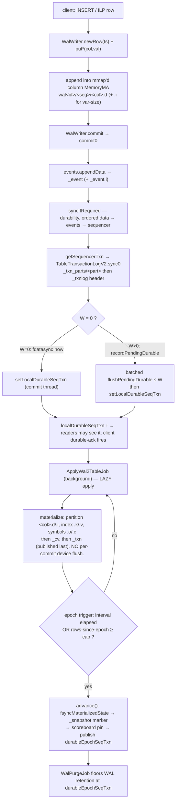
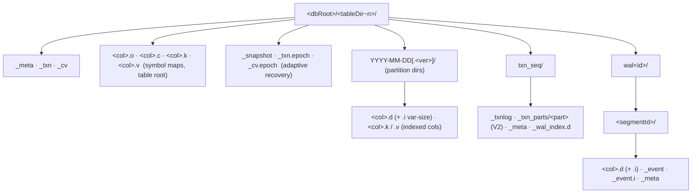
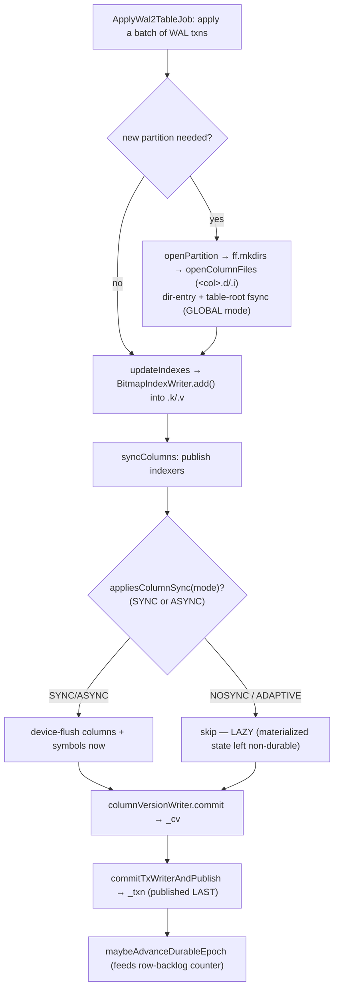
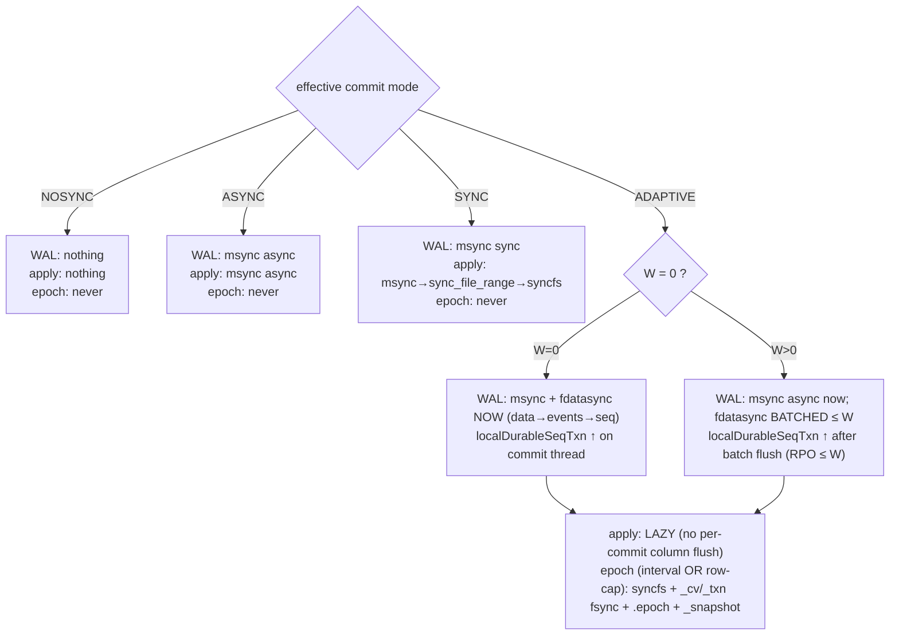

# Adaptive commit — internals & commit paths

A developer-facing companion to [`adaptive-commit-mode.md`](adaptive-commit-mode.md) (the
operator guide). This traces what actually happens on disk for a typical insert under
`CommitMode.ADAPTIVE`: every file created, every sync issued, and where durability is
established. References are to **methods** (stable) rather than line numbers (which drift).

> Scope: `nw_adaptive_commit`. `W` = `cairo.adaptive.commit.group.window`
> (`getAdaptiveCommitGroupWindowUs()`); "deferred device flush" ⇔ `W > 0`.

---

## 1. Mental model

Adaptive commit is three independent ideas stacked on QuestDB's existing WAL:

1. **Durable WAL commit.** Under `ADAPTIVE`, a WAL commit is made *device-durable*
   (`fdatasync`) before it is acknowledged — so a committed row survives power loss.
2. **Lazy table apply.** Applying the WAL to the table (materializing columns, `_txn`,
   `_cv`) is *not* synced per commit. The materialized table is a rebuildable cache of the
   durable WAL, so flushing it every apply is wasted I/O.
3. **Durable epoch.** A background epoch periodically makes the materialized state durable
   and drops a crash-recovery marker, so recovery replays only a bounded WAL tail rather
   than the whole log.

### The two durable frontiers (do not conflate them)

| Frontier | Advances when | Consumed by |
|---|---|---|
| **`localDurableSeqTxn`** | the WAL commit's `fdatasync` completes (W=0: every commit; W>0: after the ≤W batch flush) | **reader visibility** (INV‑3) + the QWP client durable‑ack frame |
| **`durableEpochSeqTxn`** | a durable epoch publishes | **only** `WalPurgeJob` (the WAL‑purge floor) + `wal_tables()` observability |

Reads and client acks gate on **`localDurableSeqTxn`** — never on the epoch. The epoch
(`durableEpochSeqTxn`) is *only* the WAL‑purge floor and the recovery‑replay start point.
Consequently the epoch cadence affects WAL disk retention, recovery‑replay lag, and
`syncfs` frequency — but **not** read freshness, durable‑ack, or ingest throughput. Both
frontiers live on `SeqTxnTracker` (per table).

### Effective vs global commit mode

The effective mode of a table is its per‑table `_meta` override, else the global
`cairo.commit.mode` (`CommitMode.effectiveCommitMode`). **Load‑bearing asymmetry:** the
WAL‑commit path (`WalWriter.walCommitMode`), the WAL‑purge floor, and the epoch trigger use
the **per‑table effective** mode; but `TxWriter.commit` (`_txn`), `ColumnVersionWriter.commit`
(`_cv`), `BitmapIndexWriter.commit` (indexes), and the partition‑dir fsync in `openPartition`
read the **global** `configuration.getCommitMode()` and have no `ADAPTIVE` branch (they treat
`ADAPTIVE` as "not NOSYNC" ⇒ `msync`). See [Caveats](#8-caveats--gotchas).

---

## 2. Diagram D1 — the life of an insert (end to end)



The **left rail** (ingest → WAL → `localDurableSeqTxn`) is the zero‑loss commit path. The
**bottom rail** (apply → epoch → purge) is the lazy materialization + recovery‑bound path.
They are decoupled: apply and epochs run in the background and never block a commit.

---

## 3. Ingest → WAL segment write

`WalWriter` construction creates the WAL directory tree and the first segment:
`mkWalDir()` → `configureColumns()` → `openNewSegment()`.

**Files created** (under the table's data dir `…/<tableDir~n>/`):

- `wal<walId>/` — one directory per writer.
- `wal<walId>/<segmentId>/` — one per segment; created by `createSegmentDir` (`ff.mkdirs`).
  Per segment: `<col>.d` (fixed/data) and `<col>.i` (aux index, var‑size columns only);
  `_event` + `_event.i` (the WAL‑e transaction log, `WalEventWriter.openEventFile`); `_meta`
  (segment metadata, `WalWriterMetadata.switchTo` → `openSmallFile`).

`newRow(ts)` returns a shared row; `put*(col,val)` writes straight into the append‑only
mmap'd column (`dataMem.setAppendOnly(true)`). `commit()` → `commit0()`:
`events.appendData(...)` writes the `_event` transaction record, then `syncIfRequired()`
(durability, §4), then `getSequencerTxn()` (§5), then the adaptive frontier bookkeeping.

**Segment roll** (`mayRollSegmentOnNextRow`): when `segmentRowCount >=
getWalSegmentRolloverRowCount()`, the next row triggers `openNewSegment()` (a new
`<segmentId>/` with fresh column/event/meta files). A pending W>0 device flush is forced at
the roll so nothing is left un‑flushed across segments.

---

## 4. WAL commit durability (data → events → sequencer)

The durability order is strict: **segment data → events → sequencer**, so a durable
sequencer pointer never precedes the data it names. This is enforced in `commit0` and
`WalWriter.syncIfRequired`:

```text
syncIfRequired(commitMode):
  if commitMode == NOSYNC: return                       # nothing synced
  deferDeviceFlush = (commitMode == ADAPTIVE) && (W > 0)
  async            = (commitMode == ASYNC) || deferDeviceFlush
  for each column:  column.sync(async)                  # msync MS_SYNC or MS_ASYNC
  if commitMode == ADAPTIVE && !deferDeviceFlush:       # W = 0
      ff.fdatasync(column.fd)                            # per-column device flush
  events.sync(commitMode)                               # msync (+ fdatasync _event/_event.i if W=0)
  # sequencer durability happens inside getSequencerTxn → TableTransactionLogV2.sync0
```

**Per‑mode behavior of one WAL commit:**

- **NOSYNC** — no `msync`, no `fdatasync` anywhere.
- **ASYNC** — `msync(MS_ASYNC)` on columns, events, sequencer. No device flush.
- **SYNC** — `msync(MS_SYNC)` on columns, events, sequencer. No `fdatasync`.
- **ADAPTIVE, W=0** — `msync(MS_SYNC)` **+ `fdatasync`** per column, then events, then
  sequencer part+header, synchronously in order. Then `commit0` calls
  `setLocalDurableSeqTxn(seqTxn)` **on the commit thread** — the durable‑ack frontier
  advances immediately.
- **ADAPTIVE, W>0** — columns/events/sequencer get `msync(MS_ASYNC)` only (page cache,
  ordered, not yet device‑durable). `commit0` calls `recordPendingDurable(seqTxn)`,
  registers the writer on the flush queue, and if the oldest pending age ≥ W flushes now.
  `localDurableSeqTxn` is **not** advanced here.

**The batched flush** (`WalWriter.flushPendingDurable`, W>0): `fdatasync` all columns →
`events.fdatasync()` → `sequencer.fdatasyncTxnLog()` → `setLocalDurableSeqTxn(flushTo)`.
The frontier advances **only** here, after the device flush. Also driven by the background
`forceDurableIfPending(now, W)` (age‑gated, bounds RPO ≤ W even when commits stop) and
defensively at segment open/roll.

---

## 5. The sequencer (transaction log)

**Files** (under `…/<tableDir~n>/txn_seq/`): header `_txnlog`; **V2 (default)** records in
`_txn_parts/<part>`; **V1** in `_txnlog.meta.i` + `_txnlog.meta.d`; plus sequencer `_meta`
and `_wal_index.d`.

`WalWriter.getSequencerTxn` → `TableSequencerImpl.nextTxn` → `pushCommitModeToLog()` (records
the per‑table effective mode onto the log) → append txn → `sync0()`:

```text
TableTransactionLogV2.sync0(tableCommitMode, global):
  mode = effectiveCommitMode(tableCommitMode, global)
  if mode == NOSYNC: return
  deferDeviceFlush = (mode == ADAPTIVE) && (W > 0)
  async            = (mode == ASYNC) || deferDeviceFlush
  txnPartMem.sync(async)        # PART first
  txnMem.sync(async)            # header second
  if mode == ADAPTIVE && !deferDeviceFlush:   # W = 0
      ff.fdatasync(txnPartMem.fd)   # part durable first
      ff.fdatasync(txnMem.fd)       # header (maxTxn) durable last
```

**Ordering invariant:** the part file is durable before the header that names it, so a
durable `maxTxn = N` never precedes record `N`. The deferred flush `fdatasyncTxnLog()` (part
then header) is reached from `WalWriter.flushPendingDurable` under W>0.

---

## 6. Diagram D2 — on-disk layout of an adaptive table



The **table root + partitions** are the materialized state (written lazily by apply). The
**`txn_seq/` + `wal<id>/`** trees are the durable WAL (written eagerly by commit). The
**`_snapshot` / `.epoch`** trio is the adaptive recovery anchor (written by the epoch).

---

## 7. WAL → table apply, file creation, index & symbol writes

`ApplyWal2TableJob.applyOutstandingWalTransactions` drives the apply loop:
`processWalCommit` / `processWalCommitBlock` → o3‑vs‑append decision in
`processWalCommitFinishApply` → `commit()` → `commit00()`:

```text
commit00():
  updateIndexes()                      # drive BitmapIndexWriter.add() into .k/.v
  syncColumns()                        # publish indexers + GATED column device flush
  columnVersionWriter.commit()         # _cv
  commitTxWriterAndPublish(...)        # _txn — the visibility pointer, LAST
```

### The lazy‑apply gate

`syncColumns()` always calls `indexer.getWriter().commit()` (publish), then gates the
device flush on `CommitMode.appliesColumnSync(commitMode)`, which is **true only for SYNC
and ASYNC**:

- **SYNC** → `syncColumnsBatchedSync()` (Linux: KICK `msync(MS_ASYNC)` → DRAIN
  `sync_file_range` → one `syncfs`).
- **ASYNC** → per‑file async sync (data before aux) + symbol `sync(async)`.
- **NOSYNC and ADAPTIVE** → **skipped** — this is the lazy apply. `ADAPTIVE` additionally
  sets `applyLazyColumns` (`configureColumn`) so even routine append‑page‑release `msync`s
  are suppressed.

`_cv` (`ColumnVersionWriter.commit`) and `_txn` (`TxWriter.commit`) are `msync`‑gated on the
**global** commit mode (no `fdatasync`, no `ADAPTIVE` branch — see [Caveats](#8-caveats--gotchas)).

### File creation on apply

- **New partition** (append or o3): `openPartition()` → `ff.mkdirs(path)` →
  `openColumnFiles()` opens each `<col>.d` / `.i`. The partition **dir entry** fsync +
  table‑root fsync are gated on the **global** mode `!= NOSYNC` (structural durability, not
  `appliesColumnSync`).
- **o3 split / squash / attach**: partition dirs via `createDirsOrFail`; detached via
  `ff.mkdirs`.
- **Column add**: `openColumnFiles` into the existing partition.

### Index writes (`BitmapIndexWriter`, `.k` / `.v`)

`.k` = keys, `.v` = values; `keyMem`/`valueMem` are random‑access MARW written incrementally
during `add()`. `commit()` reads the **global** mode and `sync(async)`s **`valueMem` before
`keyMem`** (value/data before key/pointer). Indexers are *always* published from
`syncColumns` and `fsyncMaterializedState`; the *device flush* is global‑mode‑gated, but at
an epoch the index files are made durable by the filesystem‑wide `syncfs` regardless.

### Symbol writes (`SymbolMapWriter`, files at the table root)

`<col>.o` (offsets), `<col>.c` (chars), plus an embedded bitmap index `<col>.k`/`.v`.
`sync(async)` order: `charMem` → `offsetMem` → `indexWriter`. On apply, symbol writers are
synced only inside the `appliesColumnSync` (SYNC/ASYNC) branch — so ADAPTIVE/NOSYNC skip
them per commit; the epoch flushes them unconditionally.

### Diagram D3 — apply write path



Under ADAPTIVE the whole middle (`FLUSH`) is skipped every commit; durability of the
materialized columns, indexes, and symbols is deferred to the next **epoch**.

---

## 8. The durable epoch + recovery

`ApplyWal2TableJob.maybeAdvanceDurableEpoch` runs after each applied batch. It bails if the
table's effective mode isn't `ADAPTIVE`, or if local durability is disabled (an Enterprise
replica — the materialized state is a rebuildable cache of object‑store truth). It fires when
the **cadence interval has elapsed OR the un‑epoched applied‑row backlog reaches the cap**
(`getAdaptiveEpochIntervalMs()` / `getAdaptiveEpochMaxRows()`; a negative interval disables
epochs entirely) → `advance()`.

`advance()` writes a fully‑durable, self‑consistent cut in a strict order (INV‑5 — each
step's effect is durable before the next is published):

```text
advance():
  re-check local durability (demote-in-window guard)
  1. writer.fsyncMaterializedState()          # make columns/_cv/_txn durable + write .epoch copies
  2. snapshotMarker.write(epochSeqTxn, epochTxn, now)   # _snapshot — the crash boundary
  3. scoreboard.incrementTxn(newSlot, epochTxn)         # pin NEW epoch (ping-pong)
     scoreboard.releaseTxn(priorSlot, priorTxn)         # release prior (pin-before-release)
  4. setDurableEpochSeqTxn(epochSeqTxn)        # publish the WAL-purge floor
     setLastEpochTs(now); resetRowsSinceEpoch()          # cadence + backlog reset, LAST
```

`fsyncMaterializedState()` makes the materialized state durable **unconditionally** (this is
the one place ADAPTIVE forces the table to disk): publish indexers → columns durable (Linux
batched, else per‑file + symbols) → **`syncfs`** (a whole‑filesystem flush, to catch
closed‑partition files the writer no longer tracks) → `columnVersionWriter.fsync()` →
`txWriter.fsync()` (**`_cv` before `_txn`**) → write the epoch copies **`_cv.epoch` then
`_txn.epoch`** (`writeEpochCopy` = `ff.copy` + real `ff.fsync`). Both `TxWriter.fsync` and
`ColumnVersionWriter.fsync` are `msync(MS_SYNC)` **+ real `ff.fsync(fd)`** despite the
`.fsync()` name; `SnapshotMarker.write` is an A/B‑slot write + `storeFence` + version bump +
`msync` + `ff.fsync`.

> **Note on cost:** the epoch's dominant cost is the `syncfs` — whole‑filesystem, so its
> latency scales with *system‑wide* dirty pages, not just this table's. On busy shared
> storage epochs get expensive and spiky. The interval + row cap bound how often you pay it.

### Recovery

`RecoveryCoordinator.recover()` (kill‑switch `isAdaptiveRecoveryRollForwardEnabled()`)
iterates WAL tables, skipping non‑adaptive ones. Per table (`recoverTable`): cheap
`_snapshot` existence check → `marker.tryLoad()` → **C1** validate both `.epoch` copies +
cross‑check `_txn.epoch`'s seqTxn against the marker (skip if torn) → **C2** skip if the epoch
post‑dates the live `_txn` (stale restore / PITR) → **restore `_txn` then `_cv`** (`ff.copy`
epoch→live) → `fsync` `_txn`, `_cv`, dir → `bumpRecoveryIncarnation`. Boot then re‑applies
the WAL `(epochSeqTxn, frontier]` on top. The DB opens and serves while this catch‑up runs in
the background.

> **Deliberate order asymmetry:** the epoch *writes* `_cv.epoch` then `_txn.epoch`; recovery
> *restores* `_txn` then `_cv`. Both orders are chosen so a crash mid‑operation leaves the
> safe skew "`_txn` behind `_cv`" — a `_txn` that references column versions guaranteed
> present.

### WAL‑purge floor

`WalPurgeJob.getSafeToPurgeUpToTxn`: after the mat‑view floors, if the table's effective mode
is `ADAPTIVE`, `safeToPurgeTxn = min(safeToPurgeTxn, getDurableEpochSeqTxn())`. A fresh table
(epoch 0) retains all WAL until its first epoch; a downgraded replica (NOSYNC) doesn't apply
the floor. This is *why* the epoch bounds WAL disk: segments before the last epoch can be
reclaimed; everything after must be retained for recovery.

### Diagram D4 — durability by mode



**Per‑commit durability matrix** ("msync⊘" = `MS_ASYNC`, "msync!" = `MS_SYNC`, "—" =
skipped; **(G)** = reads the *global* mode):

| Mode | WAL columns | WAL events | Sequencer | Table apply | Index `.k/.v` **(G)** | Durable epoch |
|---|---|---|---|---|---|---|
| **NOSYNC** | — | — | — | — | — | never |
| **ASYNC** | msync⊘ | msync⊘ | msync⊘ | msync⊘ | msync⊘ | never |
| **SYNC** | msync! | msync! | msync! | msync!→syncfs | msync! | never |
| **ADAPTIVE W=0** | msync!+**fdatasync** | msync!+**fdatasync** | msync!+**fdatasync** | — (lazy) | per global | interval OR row‑cap |
| **ADAPTIVE W>0** | msync⊘; fdatasync **deferred ≤W** | msync⊘; deferred | msync⊘; deferred | — (lazy) | per global | interval OR row‑cap |

---

## 9. Caveats & gotchas

1. **Global‑vs‑effective mode split (load‑bearing).** WAL‑commit, the WAL‑purge floor, and
   the epoch trigger use the per‑table **effective** mode; but `TxWriter.commit`,
   `ColumnVersionWriter.commit`, `BitmapIndexWriter.commit`, and the partition‑dir fsync read
   the **global** `configuration.getCommitMode()` with no `ADAPTIVE` branch. Under a
   per‑table‑adaptive / global‑NOSYNC deployment those no‑op on apply (durability comes from
   the epoch); under global‑ADAPTIVE they `msync!` every apply. The epoch's own
   `fsyncMaterializedState` makes them durable regardless.
2. **`_snapshot` name is reused** for two unrelated files: the table‑dir epoch marker
   (A/B + CRC binary, `SnapshotMarker`) vs the legacy checkpoint meta (checkpoint dir,
   different format). The epoch marker is the table‑dir one.
3. **`SnapshotMarker` javadoc prose is out of date** — trust the *constants*
   (`SLOT_SIZE=48`, `FILE_SIZE=104`), not the prose.
4. **Epoch `_cv`/`_txn` durability is real `ff.fsync`**, not just `msync`, despite the
   `.fsync()` method names.
5. **The sequencer default is V2** (`_txn_parts/`). V1 (`_txnlog.meta.i/.d`) still exists;
   check the instance's format before reading diagrams that show record files.

---

*See also:* [`adaptive-commit-mode.md`](adaptive-commit-mode.md) (operator/tuning guide) and
`docs/superpowers/specs/2026-06-25-adaptive-commit-mode-design.md` (the design + invariants,
INV‑1…INV‑5).
