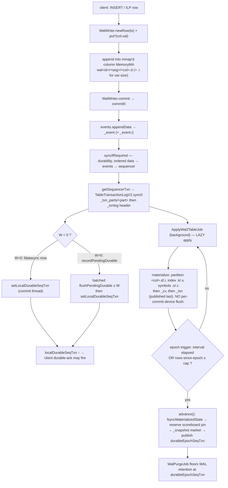
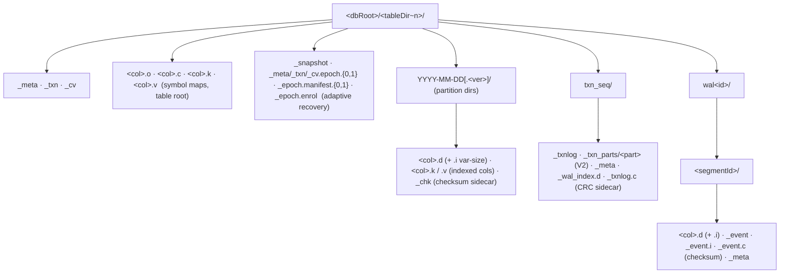
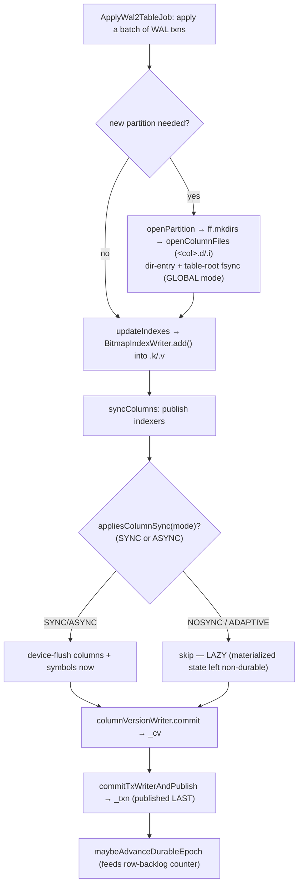
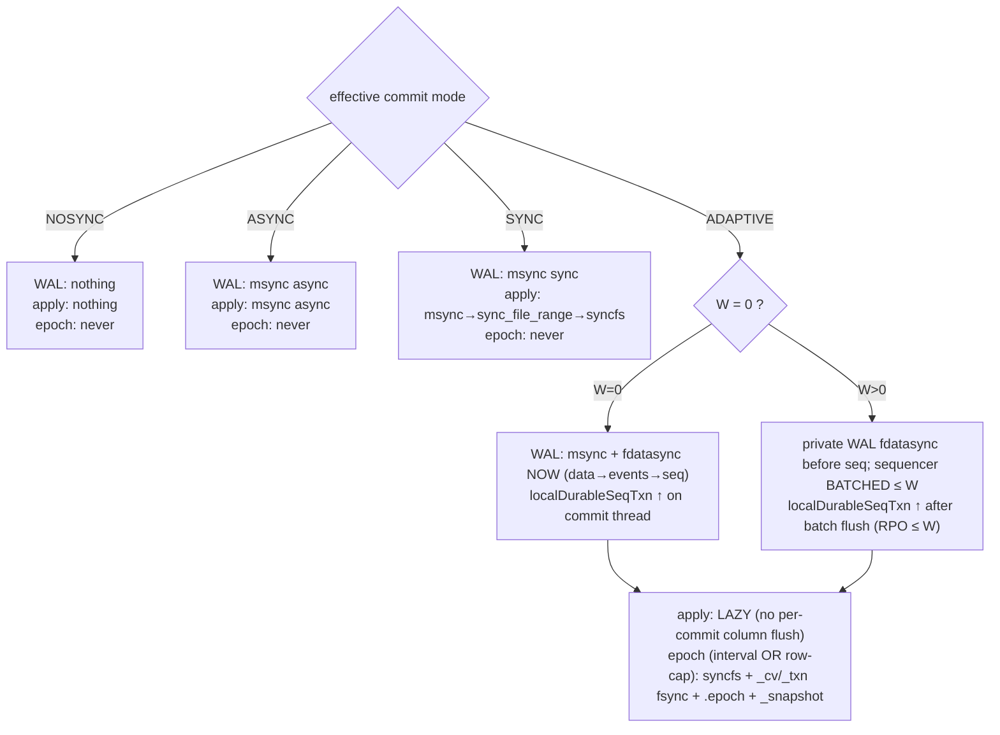

# Adaptive commit — internals & commit paths

A developer-facing companion to [`adaptive-commit-mode.md`](adaptive-commit-mode.md) (the
operator guide). This traces what actually happens on disk for a typical insert under
`CommitMode.ADAPTIVE`: every file created, every sync issued, and where durability is
established. References are to **methods** (stable) rather than line numbers (which drift).

> Scope: `nw_adaptive_commit`. `W` = `cairo.adaptive.commit.group.window`
> (`getAdaptiveCommitGroupWindowUs()`); "deferred device flush" ⇔ `W > 0`.

---

## 1. Mental model

Adaptive commit is three independent ideas stacked on QuestDB's existing WAL:

1. **Durable WAL commit.** Under `ADAPTIVE`, a WAL commit is made *device-durable*
   (`fdatasync`) before it is acknowledged — so a committed row survives power loss.
2. **Lazy table apply.** Applying the WAL to the table (materializing columns, `_txn`,
   `_cv`) is *not* synced per commit. The materialized table is a rebuildable cache of the
   durable WAL, so flushing it every apply is wasted I/O.
3. **Durable epoch.** A background epoch periodically makes the materialized state durable
   and drops a crash-recovery marker, so recovery replays only a bounded WAL tail rather
   than the whole log.

### The two durable frontiers (do not conflate them)

| Frontier | Advances when | Consumed by |
|---|---|---|
| **`localDurableSeqTxn`** | the WAL commit's `fdatasync` completes (W=0: every commit; W>0: after the ≤W batch flush) | the QWP client durable‑ack frame + observability |
| **`durableEpochSeqTxn`** | a durable epoch publishes | **only** `WalPurgeJob` (the WAL‑purge floor) + `wal_tables()` observability |

QWP durable-ack frames gate on **`localDurableSeqTxn`** — never on the epoch. Ordinary table
visibility follows WAL apply and may therefore include the configured W>0 loss window. The epoch
(`durableEpochSeqTxn`) is *only* the WAL‑purge floor and the recovery‑replay start point.
Consequently the epoch cadence affects WAL disk retention, recovery‑replay lag, and
`syncfs` frequency — but **not** ordinary read freshness, durable‑ack, or ingest throughput. Both
frontiers live on `SeqTxnTracker` (per table).

### Effective vs global commit mode

The effective mode of a table is its per‑table `_meta` override, else the global
`cairo.commit.mode` (`CommitMode.effectiveCommitMode`). **Every apply‑path durability decision uses
the effective mode**: the WAL‑commit path (`WalWriter.walCommitMode`), the WAL‑purge floor, the epoch
trigger, the column memories, and the commit pointers / indexes (`TxWriter.commit`,
`ColumnVersionWriter.commit`, `BitmapIndexWriter.commit`, `PostingIndexWriter.commit`). The last four
are threaded the mode by `TableWriter` (`setCommitMode`, republished by `reapplyColumnCommitMode` and
`populateDenseIndexerList`) and default to `CommitMode.UNSET` ⇒ "defer to the global mode" for any
transient writer that is never threaded one.

**The remaining global‑mode reads are deliberate:** structural sites that are outside the epoch's
coverage — the partition‑dir fsync in `openPartition`, `_meta`/`_todo`, and the one‑shot
`TableConverter` / `WalUtils` / `TableSnapshotRestore` writers — stay durable under
`!= NOSYNC` (the last three via `CommitMode.structuralCommitMode`, which maps ADAPTIVE onto SYNC).
See [Caveats](#8-caveats--gotchas).

---

## 2. Diagram D1 — the life of an insert (end to end)



The **left rail** (ingest → WAL → `localDurableSeqTxn`) is the zero‑loss commit path. The
**bottom rail** (apply → epoch → purge) is the lazy materialization + recovery‑bound path.
They are decoupled: apply and epochs run in the background and never block a commit.

---

## 3. Ingest → WAL segment write

`WalWriter` construction creates the WAL directory tree and the first segment:
`mkWalDir()` → `configureColumns()` → `openNewSegment()`.

**Files created** (under the table's data dir `…/<tableDir~n>/`):

- `wal<walId>/` — one directory per writer.
- `wal<walId>/<segmentId>/` — one per segment; created by `createSegmentDir` (`ff.mkdirs`).
  Per segment: `<col>.d` (fixed/data) and `<col>.i` (aux index, var‑size columns only);
  `_event` + `_event.i` (the WAL‑e transaction log, `WalEventWriter.openEventFile`); `_meta`
  (segment metadata, `WalWriterMetadata.switchTo` → `openSmallFile`).

`newRow(ts)` returns a shared row; `put*(col,val)` writes straight into the append‑only
mmap'd column (`dataMem.setAppendOnly(true)`). `commit()` → `commit0()`:
`events.appendData(...)` writes the `_event` transaction record, then `syncIfRequired()`
(durability, §4), then `getSequencerTxn()` (§5), then the adaptive frontier bookkeeping.

**Segment roll** (`mayRollSegmentOnNextRow`): when `segmentRowCount >=
getWalSegmentRolloverRowCount()`, the next row triggers `openNewSegment()` (a new
`<segmentId>/` with fresh column/event/meta files). A pending W>0 device flush is forced at
the roll so nothing is left un‑flushed across segments.

---

## 4. WAL commit durability (data → events → sequencer)

The durability order is strict: **segment data → events → sequencer**, so a durable
sequencer pointer never precedes the data it names. This is enforced in `commit0` and
`WalWriter.syncIfRequired`:

```text
syncIfRequired(commitMode):
  if commitMode == NOSYNC: return                       # nothing synced
  deferDeviceFlush = (commitMode == ADAPTIVE) && (W > 0)
  async            = (commitMode == ASYNC) || deferDeviceFlush
  for each column:  column.sync(async)                  # msync MS_SYNC or MS_ASYNC
  if commitMode == ADAPTIVE:
      ff.fdatasync(column.fd)                            # private data durable before sequencing
  events.sync(commitMode)
  if commitMode == ADAPTIVE && deferDeviceFlush:
      events.fdatasync()                                 # private event sidecars durable before sequencing
  # sequencer durability happens inside getSequencerTxn → TableTransactionLogV2.sync0
```

**Per‑mode behavior of one WAL commit:**

- **NOSYNC** — no `msync`, no `fdatasync` anywhere.
- **ASYNC** — `msync(MS_ASYNC)` on columns, events, sequencer. No device flush.
- **SYNC** — `msync(MS_SYNC)` on columns, events, sequencer. No `fdatasync`.
- **ADAPTIVE, W=0** — `msync(MS_SYNC)` **+ `fdatasync`** per column, then events, then
  sequencer part+header, synchronously in order. Then `commit0` calls
  `setLocalDurableSeqTxn(seqTxn)` **on the commit thread** — the durable‑ack frontier
  advances immediately.
- **ADAPTIVE, W>0** — columns and event/index/checksum files are `fdatasync`'d before
  sequencing, preventing one writer's shared-sequencer flush from publishing another writer's
  missing private WAL. The sequencer remains page-cache-only until the batch flush. `commit0`
  calls `recordPendingDurable(seqTxn)`, registers the writer on the flush queue, and if the oldest
  pending age ≥ W flushes now. `localDurableSeqTxn` is **not** advanced here.

**The batched flush** (`WalWriter.flushPendingDurable`, W>0):
`sequencer.fdatasyncTxnLog()` → `setLocalDurableSeqTxn(flushTo)`. Private columns/events
were already durable before sequencing.
The frontier advances **only** here, after the device flush. Also driven by the background
`forceDurableIfPending(now, W)` (age‑gated, bounds RPO ≤ W even when commits stop) and
defensively at segment open/roll.

---

### Why not one `syncfs` per window

A recurring suggestion is to drop the per-commit per-column `fdatasync` barriers above and take
one `syncfs` per group-commit window instead. It is the wrong primitive **on the commit path**,
for reasons that are checkable in the source rather than matters of taste:

1. **`syncfs` is filesystem-wide.** `files.c` (`syncfs0`): *"write back ALL dirty data of the
   WHOLE filesystem containing `fd`"*. Under ADAPTIVE the apply path deliberately leaves table
   columns dirty (`appliesColumnSync(ADAPTIVE) == false`; `TableWriter`: *"the table partition
   columns are a rebuildable cache — no apply-side flush needed"*). A commit-path `syncfs` forces
   precisely that deferred state out, which is the cost lazy apply exists to avoid.
2. **The cadence gap is ~1200x.** `cairo.adaptive.epoch.interval` defaults to 60,000 ms;
   `cairo.adaptive.commit.group.window` to 50 ms. The small, hot files rewritten on every apply
   (`_txn`, `_cv`, index `.k`/`.v`) would reach the device three orders of magnitude more often.
   `TableWriter.fsyncMaterializedState` already draws the line: *"this is NOT the per-commit apply
   path, which stays lazy by design."*
3. **It was tried and reverted.** `TableWriter.syncColumns`: *"Routing per-commit SYNC apply
   through it was reverted: see FastCommitCheck for why per-file `msync(MS_SYNC)` is the
   proven-durable baseline."*

Two related misreadings, both of which have been proposed as line-count savings:

- **`FastCommitCheck` does not disable `syncfs`.** Its gate selects only the batched KICK/DRAIN
  pipeline; the `else` branch still calls `fsyncMaterializedStateSyncFs()` on Linux (*"Linux with
  batching disabled still has a true filesystem-wide syncfs primitive"*). It is not vestigial.
- **The pin/orphan machinery in `SeqTxnTracker` is not redundant with the eager fsync — it depends
  on it.** `markWriterDurable`: *"combined with the invariant that private WAL dependencies are
  fdatasync'd BEFORE sequencing, that makes every already-sequenced txn of a dead writer
  device-durable too."* The two guard different things: the pins prevent a false durable-ack, the
  eager fsync prevents a durable sequencer record naming volatile data.

**If these barriers ever do need to move off the commit path**, the direction that preserves the
recovery invariant is a *coordinated two-phase window flush* — every participating writer flushes
its own column/event files once per window, a barrier, then the single shared-sequencer flush,
then advance `localDurableSeqTxn`. That is scoped to one table's concurrent writers (`SeqTxnTracker`
is per-table), not to every dirty inode on the volume. It requires reworking the orphan sweep, which
currently leans on the eager-fsync invariant.

**Scale first, though.** The cost is fixed per commit and amortises linearly: the §3 benchmark is
20k *single-row* commits, *"the pathological floor, not typical ingestion"*. At 1.585 ms/commit that
is ~1.6 us/row at 1,000 rows/commit and ~0.16 us/row at 10,000. It remains material for **wide
tables** (the cost scales with column-file count) and for latency-driven small commits.

## 5. The sequencer (transaction log)

**Files** (under `…/<tableDir~n>/txn_seq/`): header `_txnlog`; **V2 (default)** records in
`_txn_parts/<part>`; **V1** in `_txnlog.meta.i` + `_txnlog.meta.d`; plus sequencer `_meta`
and `_wal_index.d`.

`WalWriter.getSequencerTxn` → `TableSequencerImpl.nextTxn` → `pushCommitModeToLog()` (records
the per‑table effective mode onto the log) → append txn → `sync0()`:

```text
TableTransactionLogV2.sync0(tableCommitMode, global):
  mode = effectiveCommitMode(tableCommitMode, global)
  if mode == NOSYNC: return
  deferDeviceFlush = (mode == ADAPTIVE) && (W > 0)
  async            = (mode == ASYNC) || deferDeviceFlush
  txnPartMem.sync(async)        # PART first
  txnMem.sync(async)            # header second
  if mode == ADAPTIVE && !deferDeviceFlush:   # W = 0
      ff.fdatasync(txnPartMem.fd)   # part durable first
      ff.fdatasync(txnMem.fd)       # header (maxTxn) durable last
```

**Ordering invariant:** the part file is durable before the header that names it, so a
durable `maxTxn = N` never precedes record `N`. The deferred flush `fdatasyncTxnLog()` (part
then header) is reached from `WalWriter.flushPendingDurable` under W>0.

---

## 6. Diagram D2 — on-disk layout of an adaptive table



The **table root + partitions** are the materialized state (written lazily by apply). The
**`txn_seq/` + `wal<id>/`** trees are the durable WAL (written eagerly by commit). The
**`_snapshot` / `.epoch`** trio is the adaptive recovery anchor (written by the epoch).

Three of these are **detection-only sidecars** — `_chk` (partition blocks), `_event.c` (WAL
segment events) and `_txnlog.c` (sequencer log). They carry no durability claim and are fully
re-derivable, so their loss must cost detection, never data or ingestion; that is why
`cairo.partition.checksum.strict` defaults to `false`. `_epoch.enrol` is left in a table dir by a
restore that cleared the table's epoch artifacts, to say the cleared state is a *trustworthy
restored cut* rather than a lost anchor; it is consumed once the baseline is republished, so a
crash before that point simply re-enrols on the next start instead of losing the signal.

---

## 7. WAL → table apply, file creation, index & symbol writes

`ApplyWal2TableJob.applyOutstandingWalTransactions` drives the apply loop:
`processWalCommit` / `processWalCommitBlock` → o3‑vs‑append decision in
`processWalCommitFinishApply` → `commit()` → `commit00()`:

```text
commit00():
  updateIndexes()                      # drive BitmapIndexWriter.add() into .k/.v
  syncColumns()                        # publish indexers + GATED column device flush
  columnVersionWriter.commit()         # _cv
  commitTxWriterAndPublish(...)        # _txn — the visibility pointer, LAST
```

### The lazy‑apply gate

`syncColumns()` always calls `indexer.getWriter().commit()` (publish), then gates the
device flush on `CommitMode.appliesColumnSync(commitMode)`, which is **true only for SYNC
and ASYNC**:

- **SYNC** → `syncColumnsBatchedSync()` (Linux: KICK `msync(MS_ASYNC)` → DRAIN
  `sync_file_range` → one `syncfs`).
- **ASYNC** → per‑file async sync (data before aux) + symbol `sync(async)`.
- **NOSYNC and ADAPTIVE** → **skipped** — this is the lazy apply. `ADAPTIVE` additionally
  sets `applyLazyColumns` (`configureColumn`) so even routine append‑page‑release `msync`s
  are suppressed.

`_cv` (`ColumnVersionWriter.commit`) and `_txn` (`TxWriter.commit`) are `msync`‑gated on the
**same** `appliesColumnSync(effective)` predicate (no `fdatasync` on the apply path), so under
ADAPTIVE the commit pointers are lazy alongside the data they expose — a durable `_txn` pointing at
non‑durable columns would be a strictly worse post‑crash state than rolling both back together.
Recovery restores both from the epoch's `.epoch` copies and replays `(epoch.seqTxn, frontier]`.

### File creation on apply

- **New partition** (append or o3): `openPartition()` → `ff.mkdirs(path)` →
  `openColumnFiles()` opens each `<col>.d` / `.i`. The partition **dir entry** fsync +
  table‑root fsync are gated on `effectiveCommitMode != NOSYNC` (structural durability, so `!= NOSYNC`
  rather than `appliesColumnSync` — a directory entry is not re‑derivable from the WAL).
- **o3 split / squash / attach**: partition dirs via `createDirsOrFail`; detached via
  `ff.mkdirs`.
- **Column add**: `openColumnFiles` into the existing partition.

### Index writes (`BitmapIndexWriter`, `.k` / `.v`)

`.k` = keys, `.v` = values; `keyMem`/`valueMem` are random‑access MARW written incrementally
during `add()`. `commit()` gates on `appliesColumnSync(effective)` and `sync(async)`s **`valueMem`
before `keyMem`** (value/data before key/pointer). Indexers are *always* published from
`syncColumns` and `fsyncMaterializedState` — publishing is unconditional, only the *device flush* is
mode‑gated. At an epoch `fsyncMaterializedState` calls `sync(false)` on every indexer EXPLICITLY
(and the filesystem‑wide `syncfs` follows), so the index is durable at the cut without relying on
`syncfs`/`fsync` to pick up mmap‑dirty pages — which holds on Linux but not on the non‑syncfs
fallback path.

### Symbol writes (`SymbolMapWriter`, files at the table root)

`<col>.o` (offsets), `<col>.c` (chars), plus an embedded bitmap index `<col>.k`/`.v`.
`sync(async)` order: `charMem` → `offsetMem` → `indexWriter`. On apply, symbol writers are
synced only inside the `appliesColumnSync` (SYNC/ASYNC) branch — so ADAPTIVE/NOSYNC skip
them per commit; the epoch flushes them unconditionally.

### Diagram D3 — apply write path



Under ADAPTIVE the whole middle (`FLUSH`) is skipped every commit; durability of the
materialized columns, indexes, and symbols is deferred to the next **epoch**.

---

## 8. The durable epoch + recovery

`ApplyWal2TableJob.maybeAdvanceDurableEpoch` runs after each applied batch. It bails if the
table's effective mode isn't `ADAPTIVE`, or if local durability is disabled (an Enterprise
replica — the materialized state is a rebuildable cache of object‑store truth). It fires when
the **cadence interval has elapsed OR the un‑epoched applied‑row backlog reaches the cap**
(`getAdaptiveEpochIntervalMs()` / `getAdaptiveEpochMaxRows()`; a negative interval disables
epochs entirely) → `advance()`.

`advance()` writes a fully‑durable, self‑consistent cut in a strict order (INV‑5 — each
step's effect is durable before the next is published):

```text
advance():
  re-check local durability (demote-in-window guard)
  1. writer.fsyncMaterializedState()          # make columns/_cv/_txn durable + write .epoch copies
     non-Linux: fdatasync sequencer through epochSeqTxn  # epoch cannot outrun durable WAL
     publish localDurableSeqTxn >= epochSeqTxn
  2. scoreboard.incrementTxn(newSlot, epochTxn)         # reserve NEW pin before marker
  3. snapshotMarker.write(epochSeqTxn, epochTxn, now)   # _snapshot — the crash boundary
     scoreboard.releaseTxn(priorSlot, priorTxn)         # release prior only after marker
  4. setDurableEpochSeqTxn(epochSeqTxn)        # publish the WAL-purge floor
     setLastEpochTs(now); resetRowsSinceEpoch()          # cadence + backlog reset, LAST
```

`fsyncMaterializedState()` makes the materialized state durable **unconditionally** (this is
the one place ADAPTIVE forces the table to disk): publish indexers → columns durable (Linux
batched, else per‑file + symbols) → **`syncfs`** (a whole‑filesystem flush, to catch
closed‑partition files the writer no longer tracks) → `columnVersionWriter.fsync()` →
`txWriter.fsync()` (**`_cv` before `_txn`**) → write the inactive generation's copies
**`_meta.epoch.N`, `_cv.epoch.N`, then `_txn.epoch.N`** (`writeEpochCopy` = `ff.copy` + real `ff.fsync`) →
write `_epoch.manifest.N` binding table ID, seqTxn, table txn, column-version identity, payload
sizes and checksums → mandatory table-directory fsync → publish `_snapshot` last. Both
`TxWriter.fsync` and `ColumnVersionWriter.fsync` are `msync(MS_SYNC)` **+ real
`ff.fsync(fd)`** despite the `.fsync()` name; `SnapshotMarker.write` is an A/B‑slot write +
`storeFence` + version bump + `msync` + `ff.fsync`. Adaptive WAL-table creation publishes a
fully validated generation-0 baseline before sequencer/name registration, including a second
directory fsync after creating `_snapshot`, so recovery always has a proven replay floor even before
the first periodic epoch. `ALTER TABLE … REBASE WAL` does the same for its clone, and does it in the
**staging** dir: the clone resets `_txn`/`_meta` to a brand-new table, so the source's `.epoch`
payloads/manifests are excluded from the copy (they bind to metadata the clone no longer has) and a
fresh generation-0 baseline is published before the atomic rename. The published dir is therefore
self-consistent from the first instant it is visible — as the live table after the registry swap, or
as a crash-orphan the startup root-directory scan adopts.

> **Note on cost:** the epoch's dominant cost is the `syncfs` — whole‑filesystem, so its
> latency scales with *system‑wide* dirty pages, not just this table's. On busy shared
> storage epochs get expensive and spiky. The interval + row cap bound how often you pay it.

### Recovery

`RecoveryCoordinator.recover()` (fail-closed gate `isAdaptiveRecoveryRollForwardEnabled()`)
iterates WAL tables, skipping non‑adaptive ones; disabling recovery refuses startup when an adaptive
table is encountered. Per table (`recoverTable`): require
`_snapshot` → inspect both checksummed slots newest-cut first (the unchecksummed selector may tear) → validate the
selected generation's manifest, table/txn/column-version identities, payload sizes and
checksums → use the newest trustworthy candidate (falling back to the previous generation if
the newest payload or manifest is torn) → restore matching **`_meta`**, then **`_txn`**, then **`_cv`** (`ff.copy`
epoch→live) → `fsync` the restored files and directory → repair a reverted/invalid marker selector when needed → `bumpRecoveryIncarnation`. Boot then re‑applies
the WAL `(epochSeqTxn, frontier]` on top.

Recovery is fail-closed: an absent marker, no valid candidate, or a wrong-lineage anchor aborts
engine initialization rather than exposing the possibly non-durable live materialization. Legacy
V1 anchors remain readable only when both internally checksummed payloads load and their full
available seqTxn/table-txn/column-version tuple matches; they never fall back to live state. A synchronous `fsync`/`fdatasync`/`syncfs`/`fsyncAndClose`
or synchronous `msync` failure is logged as a fatal durability-barrier failure with operation
and errno; the first failure poisons the engine, fences writers/acknowledgements/purge, and the
server exits via `Runtime.halt(55)` without graceful writer cleanup.

> **Deliberate order asymmetry:** the epoch writes `_meta.epoch`, then `_cv.epoch`, then `_txn.epoch`; recovery
> *restores* `_txn` then `_cv`. Both orders are chosen so a crash mid‑operation leaves the
> safe skew "`_txn` behind `_cv`" — a `_txn` that references column versions guaranteed
> present.

### WAL‑purge floor

`WalPurgeJob.getSafeToPurgeUpToTxn`: after the mat‑view floors, if the table's effective mode
is `ADAPTIVE`, `safeToPurgeTxn = min(safeToPurgeTxn, getDurableEpochSeqTxn())`. A fresh table
(epoch 0) retains all WAL until its first epoch; a downgraded replica (NOSYNC) doesn't apply
the floor. This is *why* the epoch bounds WAL disk: segments before the last epoch can be
reclaimed; everything after must be retained for recovery.

### Diagram D4 — durability by mode



**Per‑commit durability matrix** ("msync⊘" = `MS_ASYNC`, "msync!" = `MS_SYNC`, "—" =
skipped). Every column reads the table's **effective** mode.

| Mode | WAL columns | WAL events | Sequencer | Table apply | `_txn` / `_cv` | Index `.k/.v` | Durable epoch |
|---|---|---|---|---|---|---|---|
| **NOSYNC** | — | — | — | — | — | — | never |
| **ASYNC** | msync⊘ | msync⊘ | msync⊘ | msync⊘ | msync⊘ | msync⊘ | never |
| **SYNC** | msync! | msync! | msync! | msync!→syncfs | msync! | msync! | never |
| **ADAPTIVE W=0** | msync!+**fdatasync** | msync!+**fdatasync** | msync!+**fdatasync** | — (lazy) | — (lazy) | — (lazy) | interval OR row‑cap |
| **ADAPTIVE W>0** | msync⊘ + **fdatasync before seq** | msync⊘ + **fdatasync before seq** | msync⊘; fdatasync deferred ≤W | — (lazy) | — (lazy) | — (lazy) | interval OR row‑cap |

The `_txn` / `_cv` / index columns follow the **table apply** column exactly: all four are gated on
`CommitMode.appliesColumnSync` (true only for SYNC/ASYNC). Under ADAPTIVE the commit pointers are as
re‑derivable as the data they expose — recovery restores them from the epoch's `.epoch` copies and
replays forward — so flushing them per apply would reintroduce the cost the lazy gate removes. The
epoch forces all of them (`TxWriter.fsync`, `ColumnVersionWriter.fsync`, and an explicit
`IndexWriter.sync(false)` per indexer) regardless of mode.

---

## 9. Caveats & gotchas

1. **Effective mode is used everywhere on the apply path** — WAL‑commit, the WAL‑purge floor, the
   epoch trigger, the column memories, and (since the commit‑pointer gate fix) `TxWriter.commit`,
   `ColumnVersionWriter.commit`, `BitmapIndexWriter.commit` and `PostingIndexWriter.commit`. Those
   four used to read the **global** `configuration.getCommitMode()` and branch on `!= NOSYNC`, which
   inverted the polarity (`WITH commit_mode='sync'` on a nosync instance silently skipped its `_txn`
   flush) and made ADAPTIVE pay a SYNC‑grade msync on every apply. They now use
   `CommitMode.appliesColumnSync(effective)`, the same predicate as the column data.
   *Still global by design:* one‑shot **structural** writers that run outside a table writer and
   outside the epoch's coverage — `TableConverter`, `WalUtils` staging, `TableSnapshotRestore` — take
   `CommitMode.structuralCommitMode`, which maps ADAPTIVE onto SYNC so they keep their historical
   `!= NOSYNC` grade. Ditto the `_meta`/`_todo`/partition‑dir fsyncs, which stay durable under
   `effectiveCommitMode != NOSYNC`.
2. **`_snapshot` name is reused** for two unrelated files: the table‑dir epoch marker
   (A/B + CRC binary, `SnapshotMarker`) vs the legacy checkpoint meta (checkpoint dir,
   different format). The epoch marker is the table‑dir one.
3. **`SnapshotMarker` prose and constants now agree** (`SLOT_BODY_SIZE=32`, `SLOT_TRAILER_SIZE=16`,
   `SLOT_SIZE=48`, `OFFSET_SLOT_B=56`, `FILE_SIZE=104`). The layout is A/B slots with a
   MAGIC + xxh3 trailer per slot; if you touch either, keep both in step.
4. **Epoch `_cv`/`_txn` durability is real `ff.fsync`**, not just `msync`, despite the
   `.fsync()` method names.
5. **The sequencer default is V2** (`_txn_parts/`). V1 (`_txnlog.meta.i/.d`) still exists;
   check the instance's format before reading diagrams that show record files.
6. **A rename does not publish a dentry** — `ALTER TABLE … REBASE WAL` moves its staging clone into
   the db root and then makes the registry swap durable (`logSwapTable` syncs `tables.d`
   unconditionally, in *every* commit mode). On POSIX the new directory entry survives a power loss
   only after its **parent** is fsynced, so `rebaseWalTable0` fsyncs the db root between the two:
   otherwise a crash in that window leaves a durable registry entry naming a directory that is gone —
   the table vanishes (the pre-rebase dir survives unregistered) and an adaptive boot aborts on the
   unreadable `_meta`. Proved by `RebaseWalPublishDurabilityCrashTest`.
   The registry's own file has the same shape: compaction renames `tables.d.tmp` → `tables.d.<N+1>` and
   then unlinks `tables.d.<N>`, so `TableNameRegistryStore` fsyncs the db root between the two — otherwise
   a crash there can keep the unlink and lose the new dentry, leaving no registry file at all. Both call
   `TableUtils.fsyncDirDurable` (fail-stop; Windows-guarded). Proved by
   `TableRegistryCompactionCrashTest`.

---

*See also:* [`adaptive-commit-mode.md`](adaptive-commit-mode.md) (operator/tuning guide) and
`docs/superpowers/specs/2026-06-25-adaptive-commit-mode-design.md` (the design + invariants,
INV‑1…INV‑5).
