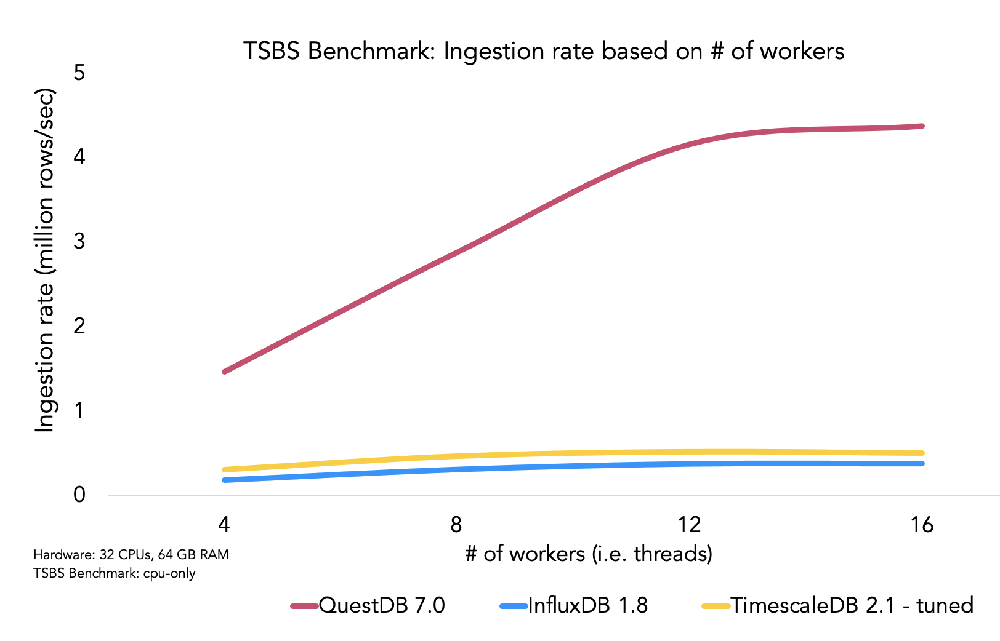

<div align="center">
  <a href="https://questdb.com/" target="blank"></a>
</div>
<p>&nbsp;</p>

<p align="center">
  <a href="#contribute">
    
  </a>
</p>

<p align="center">
  <a href="https://github.com/questdb/questdb">English</a> |
  简体中文 |
  <a href="./README.zh-hk.md">繁體中文</a> |
  <a href="./README.ar-dz.md">العربية</a> |
  <a href="./README.it-it.md">Italiano</a> |
  <a href="./README.ua-ua.md">Українська</a> |
  <a href="./README.es-es.md">Español</a> |
  <a href="./README.pt.md">Português</a> |
  <a href="./README.fr-fr.md">Français</a> |
  <a href="./README.de-de.md">Deutsch</a> |
  <a href="./README.ja-ja.md">日本語</a> |
  <a href="./README.ko-kr.md">한국어</a> |
  <a href="./README.he-il.md">עברית</a> |
  <a href="./README.nl-nl.md">Nederlands</a> |
  <a href="./README.tr-tr.md">Türkçe</a> |
  <a href="./README.hn-in.md">हिंदी</a> |
  <a href="./README.vi-vn.md">Tiếng Việt</a> |
  <a href="./README.ms-my.md">Bahasa Melayu</a>
</p>

---

QuestDB 是一个高性能开源时序数据库，提供**低延迟、高吞吐的数据写入**和**低延迟 SQL 查询**服务。

在存储上，QuestDB 提供多层引擎架构（WAL → 原生 → 对象存储上的 Parquet）。核心引擎基于零 GC 的 Java 和 C++ 实现；企业版还包含采用 Rust 编写的高性能组件。

在查询上，QuestDB 通过列式存储模型、并行化向量执行、SIMD 指令及多种低延迟技术，实现了卓越地查询性能表现。此外，QuestDB
还具备出色的硬件效率，支持快速部署与高效运维。

> 准备好了吗？立即前往
> [快速开始](#快速开始) 部分。

<p>&nbsp;</p>

<div align="center">
  <a href="https://demo.questdb.com/">
    
  </a>
  <p><em>QuestDB Web 控制台 - 点击启动演示</em></p>
</div>

<p>&nbsp;</p>

## QuestDB 的优势

核心功能亮点：

- 低延迟、高吞吐数据写入 — 支持从单条数据到每秒百万条的处理能力
- 具备时序扩展功能的高效 SQL 查询方言（ASOF JOIN、SAMPLE BY、LATEST ON）
- SIMD 指令加速的并行执行引擎，在普通硬件上也能实现亚毫秒级查询响应时间
- 多层存储架构：WAL → 原生列式存储 → Parquet（支持时间分区与时间排序）
- Postgres 协议（PGwire）和 REST API 接入
- 物化视图和 n 维数组（含适用于订单簿的二维数组）
- 用于查询与数据管理的 Web 控制台
- Apache 2.0 开源协议与开放格式——杜绝供应商绑定
- 支持多种 [金融函数](https://questdb.com/docs/reference/function/finance/)
  和 [订单簿分析](https://questdb.com/docs/guides/order-book/)

QuestDB 尤其擅长处理：

- 金融市场数据（Tick 数据、交易、订单簿、OHLC 数据）
- 具有高基数特征的传感器/遥测数据
- 实时仪表盘与监控场景

为什么要使用时序数据库？

除了优秀的性能与效率之外，专业的时序数据库能让您无需担忧以下问题：

- 乱序数据的写入处理
- 幂等与 exactly-once 保障
- 高并发查询下的持续流式数据写入
- 流式数据低延迟查询
- 高波动与突发型数据写入负载变化
- 动态添加新列——在数据持续写入时实时变更表结构

## 体验 QuestDB 和仪表板

我们提供了 [实时公共演示](https://demo.questdb.com/), 该环境基于最新版 QuestDB 并预置了以下示例数据集：

- 交易数据：实时加密货币交易记录，每月新增超3000万条（OKX交易所数据）
- 外汇订单簿：带有外汇交易对订单簿的实时图表
- 出行数据：纽约市 10 年出租车行程记录，共 16 亿行数据

我们还通过 [原生 Grafana](https://questdb.com/docs/third-party-tools/grafana/) 插件构建了一些公开的实时演示看板：

- [实时加密货币交易看板：](https://questdb.com/dashboards/crypto/)实时展示OKX交易所20余种资产的成交情况
- [外汇订单簿看板：](https://questdb.com/dashboards/FX-orderbook/)主流外汇交易对的实时深度/不平衡图表

### QuestDB 与其他数据库的性能比较

在多项性能基准测试中，QuestDB 相比其他替代方案表现优异。

如需深入了解内部机制与性能表现，请参阅以下技术博客：

- [QuestDB vs InfluxDB](https://questdb.com/blog/2024/02/26/questdb-versus-influxdb/)
- [QuestDB vs Kdb+](https://questdb.com/compare/questdb-vs-kdb/)
- [QuestDB vs TimescaleDB](https://questdb.com/blog/timescaledb-vs-questdb-comparison/)
- [QuestDB vs MongoDB](https://questdb.com/blog/mongodb-time-series-benchmark-review/)

我们推荐您亲自运行基准测试以获得最直观的性能体验。

<div align="center">
  
</div>

## 快速开始

使用 [Docker](https://www.docker.com/) 快速启动：

```bash
docker run -p 9000:9000 -p 9009:9009 -p 8812:8812 questdb/questdb
```

macOS 用户可以使用 Homebrew：

```bash
brew install questdb
brew services start questdb
```

```bash
questdb start
questdb stop
```

若需完整入门指引，建议从我们的简洁版 [快速入门指南](https://questdb.com/docs/quick-start/)开始。

### 原生数据写入客户端

支持通过 InfluxDB Line Protocol（以下简称 ILP 协议） 进行数据写入的 QuestDB 客户端：

- [Python](https://questdb.com/docs/clients/ingest-python/)
- [.NET](https://questdb.com/docs/clients/ingest-dotnet/)
- [C/C++](https://questdb.com/docs/clients/ingest-c-and-cpp/)
- [Go](https://questdb.com/docs/clients/ingest-go/)
- [Java](https://questdb.com/docs/clients/java_ilp/)
- [NodeJS](https://questdb.com/docs/clients/ingest-node/)
- [Rust](https://questdb.com/docs/clients/ingest-rust/)

### 连接 QuestDB

提供多种方式与 QuestDB 交互：

- [Web 控制台](https://questdb.com/docs/web-console/) 提供交互式 SQL 编辑器和 CSV 导入功能
- [InfluxDB Line Protocol](https://questdb.com/docs/reference/api/ilp/overview/) 支持 ILP 协议格式的流式数据写入
- [PostgreSQL Wire Protocol](https://questdb.com/docs/reference/api/postgres/) 兼容 PG 协议，可使用任意 PG 的客户端对
  QuestDB 进行连接
- [REST API](https://questdb.com/docs/reference/api/rest/) 支持通过 HTTP(S) 进行 CSV 导入和运行 SQL 查询

### 常用第三方工具

可与 QuestDB 集成的流行工具包括：

- [Kafka](https://questdb.com/docs/third-party-tools/kafka/)
- [Redpanda](https://questdb.com/docs/third-party-tools/redpanda/)
- [Grafana](https://questdb.com/docs/third-party-tools/grafana/)
- [Polars](https://questdb.com/docs/third-party-tools/polars/)
- [Pandas](https://questdb.com/docs/third-party-tools/pandas/)
- [PowerBI](https://questdb.com/docs/third-party-tools/powerbi/)
- [Superset](https://questdb.com/docs/third-party-tools/superset/)
- [Apache Flink](https://questdb.com/docs/third-party-tools/flink/)
- [Telegraf](https://questdb.com/docs/third-party-tools/telegraf/)
- [MindsDB](https://questdb.com/docs/third-party-tools/mindsdb/)

### 端到端代码示例

从流式数据写入到 Grafana 可视化，请从我们的 [快速入门代码](https://github.com/questdb/questdb-quickstart) 获取脚手架代码。

### 生产环境配置指南

查阅我们的[容量规划推荐](https://questdb.com/docs/deployment/capacity-planning/) 针对生产环境负载优化 QuestDB 配置。

### QuestDB 企业版

为大规模部署或大型组织生产环境提供安全增强版。

额外功能包括：

- 高可用性与只读副本查询
- 多主节点数据写入
- 冷存储集成
- 基于角色的访问控制（RBAC）
- TLS 加密
- 通过对象存储直接查询 Parquet 文件
- 服务等级协议（SLA）保障、监控增强等

访问[企业版页面](https://questdb.com/enterprise/)获取详细信息与联系方式。

## 扩展资源

### 📚 查阅文档

- [QuestDB 文档：](https://questdb.com/docs/)开始您的探索之旅
- [产品路线图：](https://github.com/orgs/questdb/projects/1/views/5)了解未来版本规划
- [教程：](https://questdb.com/tutorial/)通过步骤化教学掌握 QuestDB 的各种应用场景

### ❓ 获取支持

- [社区论坛：](https://community.questdb.com/)参与技术讨论、提问交流、结识其他用户！
- [公开 Slack：](https://slack.questdb.com/)与 QuestDB 团队和社区成员实时沟通
- [GitHub issues：](https://github.com/questdb/questdb/issues)报告 QuestDB 使用中遇到的问题
- [Stack Overflow：](https://stackoverflow.com/questions/tagged/questdb)查找常见问题解决方案

### 🚢 部署 QuestDB

- [AWS AMI 镜像](https://questdb.com/docs/guides/aws-official-ami)
- [Google Cloud Platform](https://questdb.com/docs/guides/google-cloud-platform)
- [官方 Docker 镜像](https://questdb.com/docs/get-started/docker)
- [DigitalOcean 云服务器](https://questdb.com/docs/guides/digitalocean)
- [Kubernetes Helm 图表](https://questdb.com/docs/guides/kubernetes)

## 参与贡献

欢迎贡献您的力量！

我们珍视以下形式的参与：

- 源代码
- 文档优化（参见 [文档代码库](https://github.com/questdb/documentation)）
- Issue 报告
- 功能建议或反馈

贡献指南：

- 查看标有 "[Good first issue](https://github.com/questdb/questdb/issues?q=is%3Aissue+is%3Aopen+label%3A%22Good+first+issue%22)" 的 GitHub issues
- Hacktoberfest 期间请关注 [标记 issues](https://github.com/questdb/questdb/issues?q=is%3Aissue+is%3Aopen+label%3Ahacktoberfest)
- 阅读[贡献指南](https://github.com/questdb/questdb/blob/master/CONTRIBUTING.md)
- 构建说明请参见 [构建说明](https://github.com/questdb/questdb/blob/master/core/README.md)
- [Fork](https://docs.github.com/en/github/getting-started-with-github/fork-a-repo) QuestDB 并提交包含改进方案的 PR
- 遇到困难？加入我们的[公开 Slack](https://slack.questdb.com/) 获取帮助

✨ 为表谢意，我们将向贡献者赠送 QuestDB 专属纪念品！

特别感谢以下为 QuestDB 做出贡献的优秀人员 [emoji](https://allcontributors.org/docs/en/emoji-key)：

<!-- ALL-CONTRIBUTORS-LIST:START - Do not remove or modify this section -->
<!-- prettier-ignore-start -->
<!-- markdownlint-disable -->
<table>
  <tbody>
    <tr>
      <td align="center" valign="top" width="14.28%"><a href="https://github.com/clickingbuttons"><br /><sub><b>clickingbuttons</b></sub></a><br /><a href="https://github.com/questdb/questdb/commits?author=clickingbuttons" title="Code">💻</a> <a href="#ideas-clickingbuttons" title="Ideas, Planning, & Feedback">🤔</a> <a href="#userTesting-clickingbuttons" title="User Testing">📓</a></td>
      <td align="center" valign="top" width="14.28%"><a href="https://github.com/ideoma"><br /><sub><b>ideoma</b></sub></a><br /><a href="https://github.com/questdb/questdb/commits?author=ideoma" title="Code">💻</a> <a href="#userTesting-ideoma" title="User Testing">📓</a> <a href="https://github.com/questdb/questdb/commits?author=ideoma" title="Tests">⚠️</a></td>
      <td align="center" valign="top" width="14.28%"><a href="https://github.com/tonytamwk"><br /><sub><b>tonytamwk</b></sub></a><br /><a href="https://github.com/questdb/questdb/commits?author=tonytamwk" title="Code">💻</a> <a href="#userTesting-tonytamwk" title="User Testing">📓</a></td>
      <td align="center" valign="top" width="14.28%"><a href="http://sirinath.com/"><br /><sub><b>sirinath</b></sub></a><br /><a href="#ideas-sirinath" title="Ideas, Planning, & Feedback">🤔</a></td>
      <td align="center" valign="top" width="14.28%"><a href="https://www.linkedin.com/in/suhorukov"><br /><sub><b>igor-suhorukov</b></sub></a><br /><a href="https://github.com/questdb/questdb/commits?author=igor-suhorukov" title="Code">💻</a> <a href="#ideas-igor-suhorukov" title="Ideas, Planning, & Feedback">🤔</a></td>
      <td align="center" valign="top" width="14.28%"><a href="https://github.com/mick2004"><br /><sub><b>mick2004</b></sub></a><br /><a href="https://github.com/questdb/questdb/commits?author=mick2004" title="Code">💻</a> <a href="#platform-mick2004" title="Packaging/porting to new platform">📦</a></td>
      <td align="center" valign="top" width="14.28%"><a href="https://rawkode.com"><br /><sub><b>rawkode</b></sub></a><br /><a href="https://github.com/questdb/questdb/commits?author=rawkode" title="Code">💻</a> <a href="#infra-rawkode" title="Infrastructure (Hosting, Build-Tools, etc)">🚇</a></td>
    </tr>
    <tr>
      <td align="center" valign="top" width="14.28%"><a href="https://solidnerd.dev"><br /><sub><b>solidnerd</b></sub></a><br /><a href="https://github.com/questdb/questdb/commits?author=solidnerd" title="Code">💻</a> <a href="#infra-solidnerd" title="Infrastructure (Hosting, Build-Tools, etc)">🚇</a></td>
      <td align="center" valign="top" width="14.28%"><a href="http://solanav.github.io"><br /><sub><b>solanav</b></sub></a><br /><a href="https://github.com/questdb/questdb/commits?author=solanav" title="Code">💻</a> <a href="https://github.com/questdb/questdb/commits?author=solanav" title="Documentation">📖</a></td>
      <td align="center" valign="top" width="14.28%"><a href="https://shantanoo-desai.github.io"><br /><sub><b>shantanoo-desai</b></sub></a><br /><a href="#blog-shantanoo-desai" title="Blogposts">📝</a> <a href="#example-shantanoo-desai" title="Examples">💡</a></td>
      <td align="center" valign="top" width="14.28%"><a href="http://alexprut.com"><br /><sub><b>alexprut</b></sub></a><br /><a href="https://github.com/questdb/questdb/commits?author=alexprut" title="Code">💻</a> <a href="#maintenance-alexprut" title="Maintenance">🚧</a></td>
      <td align="center" valign="top" width="14.28%"><a href="https://github.com/lbowman"><br /><sub><b>lbowman</b></sub></a><br /><a href="https://github.com/questdb/questdb/commits?author=lbowman" title="Code">💻</a> <a href="https://github.com/questdb/questdb/commits?author=lbowman" title="Tests">⚠️</a></td>
      <td align="center" valign="top" width="14.28%"><a href="https://tutswiki.com/"><br /><sub><b>chankeypathak</b></sub></a><br /><a href="#blog-chankeypathak" title="Blogposts">📝</a></td>
      <td align="center" valign="top" width="14.28%"><a href="https://github.com/upsidedownsmile"><br /><sub><b>upsidedownsmile</b></sub></a><br /><a href="https://github.com/questdb/questdb/commits?author=upsidedownsmile" title="Code">💻</a></td>
    </tr>
    <tr>
      <td align="center" valign="top" width="14.28%"><a href="https://github.com/Nagriar"><br /><sub><b>Nagriar</b></sub></a><br /><a href="https://github.com/questdb/questdb/commits?author=Nagriar" title="Code">💻</a></td>
      <td align="center" valign="top" width="14.28%"><a href="https://github.com/piotrrzysko"><br /><sub><b>piotrrzysko</b></sub></a><br /><a href="https://github.com/questdb/questdb/commits?author=piotrrzysko" title="Code">💻</a> <a href="https://github.com/questdb/questdb/commits?author=piotrrzysko" title="Tests">⚠️</a></td>
      <td align="center" valign="top" width="14.28%"><a href="https://github.com/mpsq/dotfiles"><br /><sub><b>mpsq</b></sub></a><br /><a href="https://github.com/questdb/questdb/commits?author=mpsq" title="Code">💻</a></td>
      <td align="center" valign="top" width="14.28%"><a href="https://github.com/siddheshlatkar"><br /><sub><b>siddheshlatkar</b></sub></a><br /><a href="https://github.com/questdb/questdb/commits?author=siddheshlatkar" title="Code">💻</a></td>
      <td align="center" valign="top" width="14.28%"><a href="http://yitaekhwang.com"><br /><sub><b>Yitaek</b></sub></a><br /><a href="#tutorial-Yitaek" title="Tutorials">✅</a> <a href="#example-Yitaek" title="Examples">💡</a></td>
      <td align="center" valign="top" width="14.28%"><a href="https://www.gaboros.hu"><br /><sub><b>gabor-boros</b></sub></a><br /><a href="#tutorial-gabor-boros" title="Tutorials">✅</a> <a href="#example-gabor-boros" title="Examples">💡</a></td>
      <td align="center" valign="top" width="14.28%"><a href="https://github.com/kovid-r"><br /><sub><b>kovid-r</b></sub></a><br /><a href="#tutorial-kovid-r" title="Tutorials">✅</a> <a href="#example-kovid-r" title="Examples">💡</a></td>
    </tr>
    <tr>
      <td align="center" valign="top" width="14.28%"><a href="https://borowski-software.de/"><br /><sub><b>TimBo93</b></sub></a><br /><a href="https://github.com/questdb/questdb/issues?q=author%3ATimBo93" title="Bug reports">🐛</a> <a href="#userTesting-TimBo93" title="User Testing">📓</a></td>
      <td align="center" valign="top" width="14.28%"><a href="http://zikani.me"><br /><sub><b>zikani03</b></sub></a><br /><a href="https://github.com/questdb/questdb/commits?author=zikani03" title="Code">💻</a></td>
      <td align="center" valign="top" width="14.28%"><a href="https://github.com/jaugsburger"><br /><sub><b>jaugsburger</b></sub></a><br /><a href="https://github.com/questdb/questdb/commits?author=jaugsburger" title="Code">💻</a> <a href="#maintenance-jaugsburger" title="Maintenance">🚧</a></td>
      <td align="center" valign="top" width="14.28%"><a href="http://www.questdb.com"><br /><sub><b>TheTanc</b></sub></a><br /><a href="#projectManagement-TheTanc" title="Project Management">📆</a> <a href="#content-TheTanc" title="Content">🖋</a> <a href="#ideas-TheTanc" title="Ideas, Planning, & Feedback">🤔</a></td>
      <td align="center" valign="top" width="14.28%"><a href="http://davidgs.com"><br /><sub><b>davidgs</b></sub></a><br /><a href="https://github.com/questdb/questdb/issues?q=author%3Adavidgs" title="Bug reports">🐛</a> <a href="#content-davidgs" title="Content">🖋</a></td>
      <td align="center" valign="top" width="14.28%"><a href="https://redalemeden.com"><br /><sub><b>kaishin</b></sub></a><br /><a href="https://github.com/questdb/questdb/commits?author=kaishin" title="Code">💻</a> <a href="#example-kaishin" title="Examples">💡</a></td>
      <td align="center" valign="top" width="14.28%"><a href="https://questdb.com"><br /><sub><b>bluestreak01</b></sub></a><br /><a href="https://github.com/questdb/questdb/commits?author=bluestreak01" title="Code">💻</a> <a href="#maintenance-bluestreak01" title="Maintenance">🚧</a> <a href="https://github.com/questdb/questdb/commits?author=bluestreak01" title="Tests">⚠️</a></td>
    </tr>
    <tr>
      <td align="center" valign="top" width="14.28%"><a href="http://patrick.spacesurfer.com/"><br /><sub><b>patrickSpaceSurfer</b></sub></a><br /><a href="https://github.com/questdb/questdb/commits?author=patrickSpaceSurfer" title="Code">💻</a> <a href="#maintenance-patrickSpaceSurfer" title="Maintenance">🚧</a> <a href="https://github.com/questdb/questdb/commits?author=patrickSpaceSurfer" title="Tests">⚠️</a></td>
      <td align="center" valign="top" width="14.28%"><a href="http://chenrui.dev"><br /><sub><b>chenrui333</b></sub></a><br /><a href="#infra-chenrui333" title="Infrastructure (Hosting, Build-Tools, etc)">🚇</a></td>
      <td align="center" valign="top" width="14.28%"><a href="http://bsmth.de"><br /><sub><b>bsmth</b></sub></a><br /><a href="https://github.com/questdb/questdb/commits?author=bsmth" title="Documentation">📖</a> <a href="#content-bsmth" title="Content">🖋</a></td>
      <td align="center" valign="top" width="14.28%"><a href="https://github.com/Ugbot"><br /><sub><b>Ugbot</b></sub></a><br /><a href="#question-Ugbot" title="Answering Questions">💬</a> <a href="#userTesting-Ugbot" title="User Testing">📓</a> <a href="#talk-Ugbot" title="Talks">📢</a></td>
      <td align="center" valign="top" width="14.28%"><a href="https://github.com/lepolac"><br /><sub><b>lepolac</b></sub></a><br /><a href="https://github.com/questdb/questdb/commits?author=lepolac" title="Code">💻</a> <a href="#tool-lepolac" title="Tools">🔧</a></td>
      <td align="center" valign="top" width="14.28%"><a href="https://github.com/tiagostutz"><br /><sub><b>tiagostutz</b></sub></a><br /><a href="#userTesting-tiagostutz" title="User Testing">📓</a> <a href="https://github.com/questdb/questdb/issues?q=author%3Atiagostutz" title="Bug reports">🐛</a> <a href="#projectManagement-tiagostutz" title="Project Management">📆</a></td>
      <td align="center" valign="top" width="14.28%"><a href="https://github.com/Lyncee59"><br /><sub><b>Lyncee59</b></sub></a><br /><a href="#ideas-Lyncee59" title="Ideas, Planning, & Feedback">🤔</a> <a href="https://github.com/questdb/questdb/commits?author=Lyncee59" title="Code">💻</a></td>
    </tr>
    <tr>
      <td align="center" valign="top" width="14.28%"><a href="https://github.com/rrjanbiah"><br /><sub><b>rrjanbiah</b></sub></a><br /><a href="https://github.com/questdb/questdb/issues?q=author%3Arrjanbiah" title="Bug reports">🐛</a></td>
      <td align="center" valign="top" width="14.28%"><a href="https://github.com/sarunas-stasaitis"><br /><sub><b>sarunas-stasaitis</b></sub></a><br /><a href="https://github.com/questdb/questdb/issues?q=author%3Asarunas-stasaitis" title="Bug reports">🐛</a></td>
      <td align="center" valign="top" width="14.28%"><a href="https://github.com/RiccardoGiro"><br /><sub><b>RiccardoGiro</b></sub></a><br /><a href="https://github.com/questdb/questdb/issues?q=author%3ARiccardoGiro" title="Bug reports">🐛</a></td>
      <td align="center" valign="top" width="14.28%"><a href="https://github.com/duggar"><br /><sub><b>duggar</b></sub></a><br /><a href="https://github.com/questdb/questdb/issues?q=author%3Aduggar" title="Bug reports">🐛</a></td>
      <td align="center" valign="top" width="14.28%"><a href="https://github.com/postol"><br /><sub><b>postol</b></sub></a><br /><a href="https://github.com/questdb/questdb/issues?q=author%3Apostol" title="Bug reports">🐛</a></td>
      <td align="center" valign="top" width="14.28%"><a href="https://github.com/petrjahoda"><br /><sub><b>petrjahoda</b></sub></a><br /><a href="https://github.com/questdb/questdb/issues?q=author%3Apetrjahoda" title="Bug reports">🐛</a></td>
      <td align="center" valign="top" width="14.28%"><a href="https://www.turecki.net"><br /><sub><b>t00</b></sub></a><br /><a href="https://github.com/questdb/questdb/issues?q=author%3At00" title="Bug reports">🐛</a></td>
    </tr>
    <tr>
      <td align="center" valign="top" width="14.28%"><a href="https://github.com/snenkov"><br /><sub><b>snenkov</b></sub></a><br /><a href="#userTesting-snenkov" title="User Testing">📓</a> <a href="https://github.com/questdb/questdb/issues?q=author%3Asnenkov" title="Bug reports">🐛</a> <a href="#ideas-snenkov" title="Ideas, Planning, & Feedback">🤔</a></td>
      <td align="center" valign="top" width="14.28%"><a href="https://www.linkedin.com/in/marregui"><br /><sub><b>marregui</b></sub></a><br /><a href="https://github.com/questdb/questdb/commits?author=marregui" title="Code">💻</a> <a href="#ideas-marregui" title="Ideas, Planning, & Feedback">🤔</a> <a href="#design-marregui" title="Design">🎨</a></td>
      <td align="center" valign="top" width="14.28%"><a href="https://github.com/bratseth"><br /><sub><b>bratseth</b></sub></a><br /><a href="https://github.com/questdb/questdb/commits?author=bratseth" title="Code">💻</a> <a href="#ideas-bratseth" title="Ideas, Planning, & Feedback">🤔</a> <a href="#userTesting-bratseth" title="User Testing">📓</a></td>
      <td align="center" valign="top" width="14.28%"><a href="https://medium.com/@wellytambunan/"><br /><sub><b>welly87</b></sub></a><br /><a href="#ideas-welly87" title="Ideas, Planning, & Feedback">🤔</a></td>
      <td align="center" valign="top" width="14.28%"><a href="http://johnleung.com"><br /><sub><b>fuzzthink</b></sub></a><br /><a href="#ideas-fuzzthink" title="Ideas, Planning, & Feedback">🤔</a> <a href="#userTesting-fuzzthink" title="User Testing">📓</a></td>
      <td align="center" valign="top" width="14.28%"><a href="https://github.com/nexthack"><br /><sub><b>nexthack</b></sub></a><br /><a href="https://github.com/questdb/questdb/commits?author=nexthack" title="Code">💻</a></td>
      <td align="center" valign="top" width="14.28%"><a href="https://github.com/g-metan"><br /><sub><b>g-metan</b></sub></a><br /><a href="https://github.com/questdb/questdb/issues?q=author%3Ag-metan" title="Bug reports">🐛</a></td>
    </tr>
    <tr>
      <td align="center" valign="top" width="14.28%"><a href="https://github.com/tim2skew"><br /><sub><b>tim2skew</b></sub></a><br /><a href="https://github.com/questdb/questdb/issues?q=author%3Atim2skew" title="Bug reports">🐛</a> <a href="#userTesting-tim2skew" title="User Testing">📓</a></td>
      <td align="center" valign="top" width="14.28%"><a href="https://github.com/ospqsp"><br /><sub><b>ospqsp</b></sub></a><br /><a href="https://github.com/questdb/questdb/issues?q=author%3Aospqsp" title="Bug reports">🐛</a></td>
      <td align="center" valign="top" width="14.28%"><a href="https://github.com/SuperFluffy"><br /><sub><b>SuperFluffy</b></sub></a><br /><a href="https://github.com/questdb/questdb/issues?q=author%3ASuperFluffy" title="Bug reports">🐛</a></td>
      <td align="center" valign="top" width="14.28%"><a href="https://github.com/nu11ptr"><br /><sub><b>nu11ptr</b></sub></a><br /><a href="https://github.com/questdb/questdb/issues?q=author%3Anu11ptr" title="Bug reports">🐛</a></td>
      <td align="center" valign="top" width="14.28%"><a href="https://github.com/comunidadio"><br /><sub><b>comunidadio</b></sub></a><br /><a href="https://github.com/questdb/questdb/issues?q=author%3Acomunidadio" title="Bug reports">🐛</a></td>
      <td align="center" valign="top" width="14.28%"><a href="https://github.com/mugendi"><br /><sub><b>mugendi</b></sub></a><br /><a href="#ideas-mugendi" title="Ideas, Planning, & Feedback">🤔</a> <a href="https://github.com/questdb/questdb/issues?q=author%3Amugendi" title="Bug reports">🐛</a> <a href="https://github.com/questdb/questdb/commits?author=mugendi" title="Documentation">📖</a></td>
      <td align="center" valign="top" width="14.28%"><a href="https://github.com/paulwoods222"><br /><sub><b>paulwoods222</b></sub></a><br /><a href="https://github.com/questdb/questdb/issues?q=author%3Apaulwoods222" title="Bug reports">🐛</a></td>
    </tr>
    <tr>
      <td align="center" valign="top" width="14.28%"><a href="https://github.com/mingodad"><br /><sub><b>mingodad</b></sub></a><br /><a href="#ideas-mingodad" title="Ideas, Planning, & Feedback">🤔</a> <a href="https://github.com/questdb/questdb/issues?q=author%3Amingodad" title="Bug reports">🐛</a> <a href="https://github.com/questdb/questdb/commits?author=mingodad" title="Documentation">📖</a></td>
      <td align="center" valign="top" width="14.28%"><a href="https://github.com/houarizegai"><br /><sub><b>houarizegai</b></sub></a><br /><a href="https://github.com/questdb/questdb/commits?author=houarizegai" title="Documentation">📖</a></td>
      <td align="center" valign="top" width="14.28%"><a href="http://scrapfly.io"><br /><sub><b>jjsaunier</b></sub></a><br /><a href="https://github.com/questdb/questdb/issues?q=author%3Ajjsaunier" title="Bug reports">🐛</a></td>
      <td align="center" valign="top" width="14.28%"><a href="https://github.com/zanek"><br /><sub><b>zanek</b></sub></a><br /><a href="#ideas-zanek" title="Ideas, Planning, & Feedback">🤔</a> <a href="#projectManagement-zanek" title="Project Management">📆</a></td>
      <td align="center" valign="top" width="14.28%"><a href="https://github.com/Geekaylee"><br /><sub><b>Geekaylee</b></sub></a><br /><a href="#userTesting-Geekaylee" title="User Testing">📓</a> <a href="#ideas-Geekaylee" title="Ideas, Planning, & Feedback">🤔</a></td>
      <td align="center" valign="top" width="14.28%"><a href="https://github.com/lg31415"><br /><sub><b>lg31415</b></sub></a><br /><a href="https://github.com/questdb/questdb/issues?q=author%3Alg31415" title="Bug reports">🐛</a> <a href="#projectManagement-lg31415" title="Project Management">📆</a></td>
      <td align="center" valign="top" width="14.28%"><a href="http://nulldev.xyz/"><br /><sub><b>null-dev</b></sub></a><br /><a href="https://github.com/questdb/questdb/issues?q=author%3Anull-dev" title="Bug reports">🐛</a> <a href="#projectManagement-null-dev" title="Project Management">📆</a></td>
    </tr>
    <tr>
      <td align="center" valign="top" width="14.28%"><a href="http://ultd.io"><br /><sub><b>ultd</b></sub></a><br /><a href="#ideas-ultd" title="Ideas, Planning, & Feedback">🤔</a> <a href="#projectManagement-ultd" title="Project Management">📆</a></td>
      <td align="center" valign="top" width="14.28%"><a href="https://github.com/ericsun2"><br /><sub><b>ericsun2</b></sub></a><br /><a href="#ideas-ericsun2" title="Ideas, Planning, & Feedback">🤔</a> <a href="https://github.com/questdb/questdb/issues?q=author%3Aericsun2" title="Bug reports">🐛</a> <a href="#projectManagement-ericsun2" title="Project Management">📆</a></td>
      <td align="center" valign="top" width="14.28%"><a href="https://www.linkedin.com/in/giovanni-k-bonetti-2809345/"><br /><sub><b>giovannibonetti</b></sub></a><br /><a href="#userTesting-giovannibonetti" title="User Testing">📓</a> <a href="https://github.com/questdb/questdb/issues?q=author%3Agiovannibonetti" title="Bug reports">🐛</a> <a href="#projectManagement-giovannibonetti" title="Project Management">📆</a></td>
      <td align="center" valign="top" width="14.28%"><a href="https://wavded.com"><br /><sub><b>wavded</b></sub></a><br /><a href="#userTesting-wavded" title="User Testing">📓</a> <a href="https://github.com/questdb/questdb/issues?q=author%3Awavded" title="Bug reports">🐛</a></td>
      <td align="center" valign="top" width="14.28%"><a href="https://medium.com/@apechkurov"><br /><sub><b>puzpuzpuz</b></sub></a><br /><a href="https://github.com/questdb/questdb/commits?author=puzpuzpuz" title="Documentation">📖</a> <a href="https://github.com/questdb/questdb/commits?author=puzpuzpuz" title="Code">💻</a> <a href="#userTesting-puzpuzpuz" title="User Testing">📓</a></td>
      <td align="center" valign="top" width="14.28%"><a href="https://github.com/rstreics"><br /><sub><b>rstreics</b></sub></a><br /><a href="https://github.com/questdb/questdb/commits?author=rstreics" title="Code">💻</a> <a href="#infra-rstreics" title="Infrastructure (Hosting, Build-Tools, etc)">🚇</a> <a href="https://github.com/questdb/questdb/commits?author=rstreics" title="Documentation">📖</a></td>
      <td align="center" valign="top" width="14.28%"><a href="https://github.com/mariusgheorghies"><br /><sub><b>mariusgheorghies</b></sub></a><br /><a href="https://github.com/questdb/questdb/commits?author=mariusgheorghies" title="Code">💻</a> <a href="#infra-mariusgheorghies" title="Infrastructure (Hosting, Build-Tools, etc)">🚇</a> <a href="https://github.com/questdb/questdb/commits?author=mariusgheorghies" title="Documentation">📖</a></td>
    </tr>
    <tr>
      <td align="center" valign="top" width="14.28%"><a href="https://github.com/pswu11"><br /><sub><b>pswu11</b></sub></a><br /><a href="#content-pswu11" title="Content">🖋</a> <a href="#ideas-pswu11" title="Ideas, Planning, & Feedback">🤔</a> <a href="#design-pswu11" title="Design">🎨</a></td>
      <td align="center" valign="top" width="14.28%"><a href="https://github.com/insmac"><br /><sub><b>insmac</b></sub></a><br /><a href="https://github.com/questdb/questdb/commits?author=insmac" title="Code">💻</a> <a href="#ideas-insmac" title="Ideas, Planning, & Feedback">🤔</a> <a href="#design-insmac" title="Design">🎨</a></td>
      <td align="center" valign="top" width="14.28%"><a href="https://github.com/eugenels"><br /><sub><b>eugenels</b></sub></a><br /><a href="https://github.com/questdb/questdb/commits?author=eugenels" title="Code">💻</a> <a href="#ideas-eugenels" title="Ideas, Planning, & Feedback">🤔</a> <a href="#maintenance-eugenels" title="Maintenance">🚧</a></td>
      <td align="center" valign="top" width="14.28%"><a href="https://github.com/bziobrowski"><br /><sub><b>bziobrowski</b></sub></a><br /><a href="https://github.com/questdb/questdb/commits?author=bziobrowski" title="Code">💻</a> <a href="#projectManagement-bziobrowski" title="Project Management">📆</a></td>
      <td align="center" valign="top" width="14.28%"><a href="https://github.com/Zapfmeister"><br /><sub><b>Zapfmeister</b></sub></a><br /><a href="https://github.com/questdb/questdb/commits?author=Zapfmeister" title="Code">💻</a> <a href="#userTesting-Zapfmeister" title="User Testing">📓</a></td>
      <td align="center" valign="top" width="14.28%"><a href="https://github.com/mkaruza"><br /><sub><b>mkaruza</b></sub></a><br /><a href="https://github.com/questdb/questdb/commits?author=mkaruza" title="Code">💻</a></td>
      <td align="center" valign="top" width="14.28%"><a href="https://github.com/DylanDKnight"><br /><sub><b>DylanDKnight</b></sub></a><br /><a href="#userTesting-DylanDKnight" title="User Testing">📓</a> <a href="https://github.com/questdb/questdb/issues?q=author%3ADylanDKnight" title="Bug reports">🐛</a></td>
    </tr>
    <tr>
      <td align="center" valign="top" width="14.28%"><a href="https://github.com/enolal826"><br /><sub><b>enolal826</b></sub></a><br /><a href="https://github.com/questdb/questdb/commits?author=enolal826" title="Code">💻</a></td>
      <td align="center" valign="top" width="14.28%"><a href="https://github.com/glasstiger"><br /><sub><b>glasstiger</b></sub></a><br /><a href="https://github.com/questdb/questdb/commits?author=glasstiger" title="Code">💻</a></td>
      <td align="center" valign="top" width="14.28%"><a href="https://arijus.net"><br /><sub><b>argshook</b></sub></a><br /><a href="https://github.com/questdb/questdb/commits?author=argshook" title="Code">💻</a> <a href="#ideas-argshook" title="Ideas, Planning, & Feedback">🤔</a> <a href="#design-argshook" title="Design">🎨</a> <a href="https://github.com/questdb/questdb/issues?q=author%3Aargshook" title="Bug reports">🐛</a></td>
      <td align="center" valign="top" width="14.28%"><a href="https://github.com/amunra"><br /><sub><b>amunra</b></sub></a><br /><a href="https://github.com/questdb/questdb/commits?author=amunra" title="Code">💻</a> <a href="https://github.com/questdb/questdb/commits?author=amunra" title="Documentation">📖</a> <a href="https://github.com/questdb/questdb/issues?q=author%3Aamunra" title="Bug reports">🐛</a></td>
      <td align="center" valign="top" width="14.28%"><a href="https://lamottsjourney.wordpress.com/"><br /><sub><b>GothamsJoker</b></sub></a><br /><a href="https://github.com/questdb/questdb/commits?author=GothamsJoker" title="Code">💻</a></td>
      <td align="center" valign="top" width="14.28%"><a href="https://github.com/kocko"><br /><sub><b>kocko</b></sub></a><br /><a href="https://github.com/questdb/questdb/commits?author=kocko" title="Code">💻</a></td>
      <td align="center" valign="top" width="14.28%"><a href="https://github.com/jerrinot"><br /><sub><b>jerrinot</b></sub></a><br /><a href="https://github.com/questdb/questdb/commits?author=jerrinot" title="Code">💻</a> <a href="#ideas-jerrinot" title="Ideas, Planning, & Feedback">🤔</a> <a href="https://github.com/questdb/questdb/issues?q=author%3Ajerrinot" title="Bug reports">🐛</a></td>
    </tr>
    <tr>
      <td align="center" valign="top" width="14.28%"><a href="http://ramiroberrelleza.com"><br /><sub><b>rberrelleza</b></sub></a><br /><a href="https://github.com/questdb/questdb/commits?author=rberrelleza" title="Code">💻</a></td>
      <td align="center" valign="top" width="14.28%"><a href="https://github.com/Cobalt-27"><br /><sub><b>Cobalt-27</b></sub></a><br /><a href="https://github.com/questdb/questdb/commits?author=Cobalt-27" title="Code">💻</a></td>
      <td align="center" valign="top" width="14.28%"><a href="https://github.com/eschultz"><br /><sub><b>eschultz</b></sub></a><br /><a href="https://github.com/questdb/questdb/commits?author=eschultz" title="Code">💻</a></td>
      <td align="center" valign="top" width="14.28%"><a href="https://www.linkedin.com/in/xinyi-qiao/"><br /><sub><b>XinyiQiao</b></sub></a><br /><a href="https://github.com/questdb/questdb/commits?author=XinyiQiao" title="Code">💻</a></td>
      <td align="center" valign="top" width="14.28%"><a href="http://chenquan.me"><br /><sub><b>terasum</b></sub></a><br /><a href="https://github.com/questdb/questdb/commits?author=terasum" title="Documentation">📖</a></td>
      <td align="center" valign="top" width="14.28%"><a href="https://www.linkedin.com/in/hristovdeveloper"><br /><sub><b>PlamenHristov</b></sub></a><br /><a href="https://github.com/questdb/questdb/commits?author=PlamenHristov" title="Code">💻</a></td>
      <td align="center" valign="top" width="14.28%"><a href="https://github.com/tris0laris"><br /><sub><b>tris0laris</b></sub></a><br /><a href="#blog-tris0laris" title="Blogposts">📝</a> <a href="#ideas-tris0laris" title="Ideas, Planning, & Feedback">🤔</a></td>
    </tr>
    <tr>
      <td align="center" valign="top" width="14.28%"><a href="https://github.com/HeZean"><br /><sub><b>HeZean</b></sub></a><br /><a href="https://github.com/questdb/questdb/commits?author=HeZean" title="Code">💻</a> <a href="https://github.com/questdb/questdb/issues?q=author%3AHeZean" title="Bug reports">🐛</a></td>
      <td align="center" valign="top" width="14.28%"><a href="https://github.com/iridess"><br /><sub><b>iridess</b></sub></a><br /><a href="https://github.com/questdb/questdb/commits?author=iridess" title="Code">💻</a> <a href="https://github.com/questdb/questdb/commits?author=iridess" title="Documentation">📖</a></td>
      <td align="center" valign="top" width="14.28%"><a href="https://www.linkedin.com/in/selmanfaruky%C4%B1lmaz/"><br /><sub><b>selmanfarukyilmaz</b></sub></a><br /><a href="https://github.com/questdb/questdb/issues?q=author%3Aselmanfarukyilmaz" title="Bug reports">🐛</a></td>
      <td align="center" valign="top" width="14.28%"><a href="http://www.donet5.com"><br /><sub><b>donet5</b></sub></a><br /><a href="#ideas-donet5" title="Ideas, Planning, & Feedback">🤔</a> <a href="https://github.com/questdb/questdb/issues?q=author%3Adonet5" title="Bug reports">🐛</a></td>
      <td align="center" valign="top" width="14.28%"><a href="https://github.com/Zahlii"><br /><sub><b>Zahlii</b></sub></a><br /><a href="https://github.com/questdb/questdb/issues?q=author%3AZahlii" title="Bug reports">🐛</a></td>
      <td align="center" valign="top" width="14.28%"><a href="https://github.com/salsasepp"><br /><sub><b>salsasepp</b></sub></a><br /><a href="https://github.com/questdb/questdb/issues?q=author%3Asalsasepp" title="Bug reports">🐛</a></td>
      <td align="center" valign="top" width="14.28%"><a href="https://github.com/EmmettM"><br /><sub><b>EmmettM</b></sub></a><br /><a href="https://github.com/questdb/questdb/issues?q=author%3AEmmettM" title="Bug reports">🐛</a> <a href="https://github.com/questdb/questdb/commits?author=EmmettM" title="Tests">⚠️</a></td>
    </tr>
    <tr>
      <td align="center" valign="top" width="14.28%"><a href="https://allfactors.com"><br /><sub><b>robd003</b></sub></a><br /><a href="#ideas-robd003" title="Ideas, Planning, & Feedback">🤔</a></td>
      <td align="center" valign="top" width="14.28%"><a href="https://github.com/AllenEdison"><br /><sub><b>AllenEdison</b></sub></a><br /><a href="https://github.com/questdb/questdb/issues?q=author%3AAllenEdison" title="Bug reports">🐛</a></td>
      <td align="center" valign="top" width="14.28%"><a href="https://github.com/CSharpDummy"><br /><sub><b>CSharpDummy</b></sub></a><br /><a href="https://github.com/questdb/questdb/issues?q=author%3ACSharpDummy" title="Bug reports">🐛</a></td>
      <td align="center" valign="top" width="14.28%"><a href="https://github.com/shimondoodkin"><br /><sub><b>shimondoodkin</b></sub></a><br /><a href="https://github.com/questdb/questdb/issues?q=author%3Ashimondoodkin" title="Bug reports">🐛</a> <a href="#ideas-shimondoodkin" title="Ideas, Planning, & Feedback">🤔</a></td>
      <td align="center" valign="top" width="14.28%"><a href="https://www.zsmart.tech/"><br /><sub><b>huuhait</b></sub></a><br /><a href="https://github.com/questdb/questdb/issues?q=author%3Ahuuhait" title="Bug reports">🐛</a> <a href="#ideas-huuhait" title="Ideas, Planning, & Feedback">🤔</a></td>
      <td align="center" valign="top" width="14.28%"><a href="https://clickhouse.com/"><br /><sub><b>alexey-milovidov</b></sub></a><br /><a href="https://github.com/questdb/questdb/issues?q=author%3Aalexey-milovidov" title="Bug reports">🐛</a></td>
      <td align="center" valign="top" width="14.28%"><a href="http://blog.suconghou.cn"><br /><sub><b>suconghou</b></sub></a><br /><a href="https://github.com/questdb/questdb/issues?q=author%3Asuconghou" title="Bug reports">🐛</a></td>
    </tr>
    <tr>
      <td align="center" valign="top" width="14.28%"><a href="https://github.com/allegraharris"><br /><sub><b>allegraharris</b></sub></a><br /><a href="https://github.com/questdb/questdb/commits?author=allegraharris" title="Code">💻</a></td>
      <td align="center" valign="top" width="14.28%"><a href="https://github.com/oliver-daniel"><br /><sub><b>oliver-daniel</b></sub></a><br /><a href="https://github.com/questdb/questdb/commits?author=oliver-daniel" title="Code">💻</a></td>
      <td align="center" valign="top" width="14.28%"><a href="https://github.com/kerimsenturk5734"><br /><sub><b>kerimsenturk5734</b></sub></a><br /><a href="https://github.com/questdb/questdb/commits?author=kerimsenturk5734" title="Documentation">📖</a></td>
    </tr>
  </tbody>
</table>

<!-- markdownlint-restore -->
<!-- prettier-ignore-end -->

<!-- ALL-CONTRIBUTORS-LIST:END -->

该项目遵循 [all-contributors](https://github.com/all-contributors/all-contributors) 规范。欢迎任何形式的贡献！